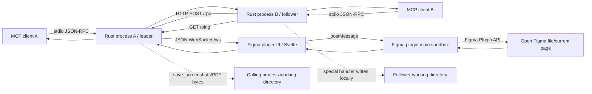

# figma-mcp-rust 전수 코드 분석 보고서

## 0. 요약 판정

`figma-mcp-rust` v0.2.0은 MCP 클라이언트와 Figma Plugin API 사이를 **stdio MCP → 로컬 Rust 리더/팔로워 → WebSocket → Figma 플러그인**으로 연결하는 양방향 자동화 브리지다. Figma REST API 토큰과 REST 호출을 쓰지 않는다는 핵심 설명은 코드와 일치하고, Rust 레지스트리와 README에는 실제로 고유한 도구 73개가 있다. 쓰기 도구도 단순 도형뿐 아니라 스타일, 변수, 페이지, 컴포넌트, 프로토타입까지 폭넓다(`README.md:17-24`, `src/tools/definitions.rs:11-542`, `plugin/src/read-handlers.ts:1-8`, `plugin/src/write-handlers.ts:1-16`).

그러나 이 프로젝트를 “Figma 완전 대체”나 “디자인↔코드 완성 서비스”로 해석하면 안 된다.

- 플러그인은 열린 Figma 문서에 대해 선별된 73개 연산만 제공한다. `full` 직렬화도 Figma 노드의 모든 속성이 아니라 ID·이름·타입·bounds와 제한된 스타일/텍스트/children 집합이다(`plugin/src/serializers.ts:120-247`).
- “디자인을 실제 코드로” 만드는 코드 생성기, AST 변환기, 레거시 저장소 수정기, 코드→Figma 파서가 저장소에는 없다. 현재 구현은 디자인 JSON·토큰·이미지를 LLM에 공급하고, LLM이 원시 생성 도구를 조합하도록 하는 기반이다.
- README/프롬프트가 권장하는 `dedupe_components`는 Rust 스키마가 snake_case를 노출하지만 플러그인은 `dedupeComponents`를 읽으므로 MCP 호출에서 작동하지 않는다(`src/tools/definitions.rs:592-600`, `plugin/src/read-document.ts:52-59`, `prompts/read_design_strategy.md:9-17`).
- 로컬 `/rpc`와 `/ws`에 인증·Origin 검증이 없고, WebSocket은 실제로 이전 연결을 닫지 않으면서 “latest wins” 포인터만 교체한다. 여러 Figma 창/문서 및 비신뢰 로컬 프로세스 환경에서는 그대로 채택하기 어렵다(`src/leader.rs:55-59,101-140`, `src/bridge.rs:70-118`).
- port bind에 실패한 `Unknown` role도 도구 payload를 해당 port의 `/rpc`로 보내며, `/ping`은 응답 본문이나 제품 identity를 확인하지 않고 임의 2xx를 leader로 신뢰한다. unrelated port owner에게 text/image/token 인자가 노출될 수 있다(`src/election.rs:52-64`, `src/follower.rs:93-111`, `src/node.rs:67-82`).
- `skipInvisibleInstanceChildren`는 process-global flag인데 plugin request queue가 없다. 동시 fast read끼리 원래 값과 다르게 복원하거나 fast read와 hidden-layer write가 겹쳐 lookup을 실패시킬 수 있다(`plugin/src/main.ts:7-22,35-55,69-101`).
- manifest가 Dev Mode(`editorType: "dev"`, `inspect`)를 허용하지만 editor-aware preflight가 없다. Design document mutation 도구는 read-only editor에서 실패하며, 정확한 도구별 matrix는 live 검증이 필요하다(`plugin/manifest.json:12-14`).
- 정적 테스트는 많지만 실제 WebSocket, 리더 선출, MCP stdio, Figma 런타임, PDF 병합의 종단 테스트가 없다. 로컬 환경에는 Cargo와 Bun이 없어 테스트/빌드는 재실행하지 못했다.

따라서 **플러그인 브리지 패턴, 선언형 도구 카탈로그, 노드 ID 검증, 스타일/토큰 읽기, 내보내기 파이프라인은 재사용 가치가 높다.** 반면 인증, 연결 세션/문서 선택, 단일 중간 표현(IR), 코드베이스 어댑터, 정책 준수, 종단 테스트는 통합 서비스에서 새로 설계해야 한다.

## 1. 조사 기준, 커밋, 라이선스

| 항목 | 확인 결과 | 근거 |
|---|---|---|
| 저장소 | `https://github.com/alvinindra/figma-mcp-rust.git` | `Cargo.toml:8`, Git `origin` |
| 기준 브랜치/커밋 | `main`, `6094566436577b29d04393c774d51492c12671e1` | 로컬 `git rev-parse HEAD`, `git branch --show-current` |
| 태그/버전 | `v0.2.0`; Cargo·Claude 플러그인·npm·MCP Registry 모두 `0.2.0` | `Cargo.toml:1-9`, `.claude-plugin/plugin.json:4`, `npm/package.json:3`, `server.json:9-14` |
| 마지막 커밋 | 2026-08-19, `chore(release): v0.2.0` | 로컬 `git show -s` |
| 라이선스 | MIT; 2026 vkhanhqui(Go 원작), alvinindra(Rust 포트) | `LICENSE:1-22` |
| 조사량 | 추적 93파일, 598,008 bytes, 물리 15,986라인, 비공백 14,200라인 | 별도 인벤토리 |

MIT는 이 저장소 코드의 사용·수정·배포를 폭넓게 허용하지만 저작권·허가 고지를 포함해야 하며 무보증이다(`LICENSE:6-21`). 이는 Figma 서비스, Plugin API, 사용자의 파일, 폰트·이미지·디자인 자산에 대한 권리나 Figma 정책 준수를 보장하지 않는다.

### 조사 방법

1. `git ls-files`로 `.git`을 제외한 추적 파일 93개를 기준 집합으로 고정했다.
2. 모든 파일을 바이트 단위로 읽고 엄격한 UTF-8 디코딩을 수행했다.
3. README·배포 메타데이터의 도구/버전 주장을 Rust 레지스트리, 플러그인 `case` 구현, 테스트와 집합 비교했다.
4. Rust `ToolDef` 73개, 플러그인 직접 처리 72개, Rust 특수 처리 2개, README 73개, Glama 58개를 각각 추출했다.
5. 문서의 사용 예를 실제 JSON Schema와 플러그인 필드명에 대조했다.

전체 파일별 수치와 역할은 [`inventories/figma-mcp-rust-file-inventory.md`](inventories/figma-mcp-rust-file-inventory.md)에 있다.

## 2. 목적과 실제 사용자 흐름

### 2.1 저장소가 해결하는 문제

README는 Figma REST API의 토큰·호출 제한 대신, 사용자가 연 Figma 파일 안에서 실행되는 플러그인이 Plugin API로 문서를 읽고 수정하도록 설계했다고 설명한다(`README.md:28-44`). 서버는 MCP 클라이언트가 이해하는 73개 도구와 12개 고정 프롬프트를 제공하고, Claude Code 플러그인 배포에는 해당 프롬프트 본문과 정확히 같은 12개 스킬 및 별도의 브리지 진단 스킬 1개를 넣는다(`src/handler.rs:38-149`, `src/prompts.rs:18-78`, `skills/**/SKILL.md`).

### 2.2 표준 흐름

1. 사용자가 `npx -y @alvinindra/figma-mcp-rust`를 MCP stdio 서버로 등록한다(`README.md:47-97`, `npm/bin/run.js:10-39`).
2. Rust 프로세스가 기본 `127.0.0.1:1994` 바인드를 시도한다. 성공하면 리더, bind 실패 후 `/ping`이 2xx이면 팔로워가 된다. 이 ping은 현재 body/product identity를 검증하지 않는다(`src/main.rs:19-50`, `src/election.rs:23-65`, `src/follower.rs:93-111`).
3. 사용자가 Figma Desktop에서 개발 플러그인을 import하고 대상 파일에서 창을 연다(`README.md:99-103`, `src/handler.rs:47-52`).
4. 플러그인 UI가 `ws://<host>:<port>/ws`에 연결한다. 주소는 `figma.clientStorage`에 저장되고 끊기면 1.5초 후 재연결한다(`plugin/src/ui/App.svelte:11-73,107-158`, `plugin/src/main.ts:69-89`).
5. MCP 도구 호출은 리더면 WebSocket으로 직접, 팔로워면 리더의 `/rpc`로 전달된다(`src/node.rs:51-82`, `src/follower.rs:32-91`).
6. 플러그인 메인 샌드박스가 읽기/쓰기 핸들러를 호출하고 Figma Plugin API 결과를 UI→WebSocket으로 돌려준다(`plugin/src/main.ts:35-55,90-101`).
7. 일반 결과는 MCP의 text content 안에 JSON 문자열로 반환된다. 오류도 transport error가 아니라 대부분 `CallToolResult::error` text로 반환된다(`src/handler.rs:63-115,177-183`).

### 2.3 한 프로세스가 의미하는 대상

플러그인은 `figma.currentPage`, `figma.root`, 현재 selection을 사용하므로 대상은 **현재 플러그인 창이 열린 한 Figma 파일/페이지**다(`plugin/src/read-document.ts:5-20,202-225,228-271`). 서버는 연결별 파일 ID나 세션 ID를 모델링하지 않고 활성 WebSocket sink 하나만 가진다(`src/bridge.rs:41-63`). 즉 여러 MCP 클라이언트는 한 리더를 공유할 수 있지만, 서로 다른 Figma 문서를 안정적으로 동시에 지정하는 멀티테넌트 구조는 아니다.

## 3. 비용·호출 제약을 벗어나는 기술 메커니즘

### 3.1 무엇을 우회하는가

기술 경로에는 Figma REST API endpoint, REST access token/OAuth, REST rate-limit 처리 코드가 없다. MCP 호출은 사용자의 로컬 프로세스와 플러그인 WebSocket을 거쳐, 열린 문서의 Figma Plugin API 메서드(`figma.getNodeByIdAsync`, `figma.createFrame`, `figma.variables.*` 등)로 실행된다. 따라서 **REST API 호출량이나 공식 Dev Mode MCP 호출 경로에 종속되지 않는 것**이 이 구현의 핵심이다(`README.md:17,28-44`, `plugin/src/read-document.ts`, `plugin/src/write-create.ts`, `plugin/src/write-variables.ts`).

로컬 HTTP `/rpc`는 존재하지만 Figma REST API가 아니라 같은 PC의 여러 MCP 프로세스가 한 WebSocket을 공유하기 위한 내부 프록시다(`src/leader.rs:55-59,116-173`, `src/follower.rs:45-66`). “No REST API”는 “Figma REST API를 호출하지 않는다”로 읽어야 정확하다.

README는 “REST 기반 MCP”를 설명한 직후 월간·일간 tool-call 표를 제시해 **REST API rate-limit 체계와 official Figma MCP tool-limit 체계를 한 문맥에 혼합**한다(`README.md:28-43`). 두 체계는 별도다.

| 공식 표면 | 제한의 기준 | 이 저장소가 호출하는 횟수 |
|---|---|---:|
| Figma REST API | endpoint tier, seat, resource plan 등의 REST 정책 | 0 |
| official Figma MCP | plan/seat 및 월간·일간·분당 tool-call 정책 | 0 |
| 이 저장소의 local MCP/Plugin API | local CPU·memory, WebSocket/HTTP payload, Plugin API/editor/plan, agent/LLM 비용 | 실제 사용량에 따라 발생 |

공식 수치는 문서 노출 방식에 따라 달라질 수 있고 Figma가 변경할 수 있으므로 이 보고서에서는 특정 숫자를 고정하지 않는다. 출시 시 [REST API rate limits](https://developers.figma.com/docs/rest-api/rate-limits/)와 [Figma MCP plans, access and permissions](https://developers.figma.com/docs/figma-mcp-server/plans-access-and-permissions/)의 확인일 기준 값을 별도로 검증해야 한다. 확정 가능한 사실은 이 repository code path가 둘 중 어느 cloud endpoint도 호출하지 않는다는 점이다. 이는 Figma subscription/seat, Plugin API 한계, LLM inference token, local compute, support·distribution 비용이 0이라는 뜻이 아니다.

### 3.2 전제 조건

- 사용자가 대상 파일을 열고 플러그인을 실행해야 한다. 창을 닫으면 WebSocket도 끊긴다(`src/handler.rs:47-51`, `skills/bridge-troubleshooting/SKILL.md:12-24`).
- 코드 자체는 파일 권한·조직 통제·플러그인 실행 자격을 획득하거나 우회하지 않는다. 플러그인이 현재 사용자의 Plugin API 권한 안에서 동작할 뿐이다.
- 저장소의 공식 설치 문서는 Figma **Desktop 개발 플러그인 import**만 설명한다. 웹 페이지 DOM을 읽거나 Figma 웹 앱을 자동 조작하는 브라우저 확장/스크립트는 없다(`README.md:99-103`, `plugin/manifest.json:1-15`).
- 무료 플랜에서도 모든 기능이 같지는 않다. 프로젝트 자체도 한 컬렉션의 다중 변수 모드가 무료 플랜에서 실패할 수 있다고 설명하고 이름 prefix 우회 워크플로를 제안한다(`src/tools/definitions.rs:431-443`, `prompts/design_token_generation_strategy.md:53-88`).
- Figma Design에서 plugin을 사용하려면 현재 정책상 적절한 seat/editor 맥락과 대상 파일의 `can edit` 권한이 필요하다. Dev Mode는 plugin을 read-only로 실행하므로 문서 mutation은 Design mode로 전환해야 한다. 이 저장소에는 editor preflight나 capability matrix가 없다.

### 3.3 무엇을 우회하지 못하는가

| 제약 | 이 코드의 상태 |
|---|---|
| 파일 열람/편집 권한 | 획득·상승 코드 없음. 현재 사용자가 Plugin API로 접근 가능한 열린 문서만 대상 |
| Figma 플랜별 Plugin API 기능 | 변수 mode 제한처럼 그대로 적용됨 |
| 조직의 플러그인 허용/배포 통제 | 우회 기능 없음; 개발 import 또는 승인된 배포 경로가 필요 |
| Figma Plugin API가 노출하지 않는 데이터/행동 | 도구로 제공 불가 |
| Dev Mode read-only/editor 차이 | read/export는 가능하나 document mutation은 실패; `navigate_to_page` 같은 UI-state 동작까지 포함한 세부 matrix는 live 검증 필요 |
| 공식 정책·Developer Terms | MIT와 별개이며 기술적으로 호출된다고 허용이 보장되지 않음 |
| 브라우저의 임의 Figma UX/DOM 분석 | 구현 없음 |
| 코드 저장소 분석·수정 | 구현 없음; 별도 AST/파일시스템/빌드 어댑터 필요 |
| AI/local 운영 비용 | Claude/Codex 등 model token, local CPU/memory, 지원·배포 비용은 그대로 발생 |

### 3.4 정책·배포 경계

이 절은 법률 자문이 아니라 2026-08-27 기준 공식 문서 검토를 통합하기 위한 기술 경계다. Figma의 [Developer Terms](https://www.figma.com/legal/developer-terms/)는 Developer Resources 범위와 사용 조건을 두며, [플러그인·위젯 심사 지침](https://help.figma.com/hc/en-us/articles/360039958914-Plugin-and-widget-review-guidelines)은 공개 배포 시 유료 기능 workaround 또는 공식 MCP 밖의 programmatic AI access 성격을 심사할 수 있다. [파일에서 플러그인 사용](https://help.figma.com/hc/en-us/articles/360042532714-Use-plugins-in-files), [플러그인 실행 모델](https://developers.figma.com/docs/plugins/how-plugins-run/), [조직 private plugin](https://help.figma.com/hc/en-us/articles/4404228629655-Create-private-plugins-for-an-organization)도 플랜·편집 권한·배포 방식에 영향을 준다.

그러므로 제품 표현은 “라이선스 정책 회피”보다 **“사용자가 권한을 가진 열린 문서에서 동작하는 로컬 Plugin API 브리지”**가 정확하다. 인증·권한·결제 통제를 침해하거나 정책 위반을 숨기는 기능은 이 코드에도 없고 통합 서비스에도 넣어서는 안 된다. README의 “free, no rate limits”는 code path에 자체 rate limiter와 공식 REST/MCP 호출이 없다는 기술 설명이지, 무제한 사용 권리·무료 좌석·공개 플러그인 승인이나 LLM 비용 0을 보장하는 문구가 아니다(`README.md:9-24`). 브리지 패턴의 재사용 평가는 사용자가 직접 실행하는 internal development/sideloaded 환경 또는 적법하게 승인된 private deployment에 한정해야 한다. Community/public SaaS는 Figma 확인 전 기술 재사용 후보와 정책상 출시 후보를 분리한다.

## 4. 기술 스택과 의존성

### 4.1 계층별 스택

| 계층 | 기술 | 역할 | 근거 |
|---|---|---|---|
| MCP 서버 | Rust 2021, 명시 MSRV 1.78 | 바이너리·라이브러리 | `Cargo.toml:1-17` |
| MCP SDK | `rmcp` 3.1.3 | stdio transport, ServerHandler, tool/prompt 모델 | `Cargo.toml:19-22`, `Cargo.lock`, `src/handler.rs:9-16` |
| 비동기 | Tokio 1.52.3, futures, tokio-util | 런타임·signal·oneshot·취소·stream | `Cargo.toml:24-28`, `src/main.rs:31`, `src/bridge.rs:17-21` |
| 리더 서버 | Axum 0.7.9 | `/ping`, `/rpc`, `/ws` | `Cargo.toml:30-34`, `src/leader.rs:47-75` |
| 팔로워 | reqwest 0.12.28 + rustls | 로컬 리더 HTTP 호출 | `Cargo.toml:36-37`, `src/follower.rs:17-29` |
| 직렬화 | serde/serde_json | MCP 인자, RPC, WebSocket JSON | `Cargo.toml:39-41`, `src/types.rs:3-67` |
| 동시성 | DashMap, oneshot, `RwLock`, `Mutex`, `Notify` | pending correlation·sink 직렬화 | `src/bridge.rs:20,31-47` |
| CLI/로그 | clap, tracing | `--ip`, `--port`, stderr 구조화 로그 | `src/main.rs:7-29,106-115` |
| 파일/PDF | base64, lopdf | 이미지 저장·PDF 병합 | `src/tools/special.rs:1-18`, `src/pdf.rs:1-10` |
| Figma 플러그인 | TypeScript 5.9.3, Figma typings 1.124.0 | Plugin API 메인 샌드박스 | `plugin/package.json:11-19`, `plugin/bun.lock` |
| 플러그인 UI | Svelte 5.55.0, Vite 6.4.1 | WebSocket 및 상태 UI, 단일 HTML 빌드 | `plugin/src/ui/App.svelte`, `plugin/vite.config.ts:1-19` |
| 배포 런처 | Node >=18 | OS/arch별 Rust 바이너리 선택 | `npm/package.json:5-16,35-37`, `npm/bin/run.js:10-39` |

Cargo.lock에는 272개 package block, 249개 고유 패키지명이 있다. 주요 직접 잠금 버전은 `rmcp 3.1.3`, `tokio 1.52.3`, `axum 0.7.9`, `reqwest 0.12.28`, `serde 1.0.228`, `serde_json 1.0.150`, `clap 4.6.1`, `dashmap 6.2.1`, `lopdf 0.34.0`이다(`Cargo.lock`).

### 4.2 의존성 기술부채

정적 식별자 검색상 `async-trait`, `tower`, `tower-http`, `hyper`, `schemars`는 프로젝트 소스에서 직접 참조되지 않는다. 일부는 feature/transitive 요구를 명시하려는 것일 수 있으나, 현재 Cargo 선언만 보면 정리 후보다(`Cargo.toml:21-37`). `src/main.rs:75`의 주석은 “rmcp 0.3”이라 적지만 실제 의존성은 major 3이다. CI는 `stable`만 사용해 `rust-version = 1.78` 최소 버전을 별도로 검증하지 않는다(`.github/workflows/ci.yml:31-53`).

플러그인은 `strict: false`이고 handler 인자·node 접근에 `any`를 광범위하게 사용해 서버 JSON Schema와 플러그인 필드 불일치가 컴파일 단계에서 잡히지 않는다(`plugin/tsconfig.json:2-10`). 단순 lexical 검색으로는 주석의 영어 단어까지 포함되므로 `any` 개수 자체는 type-safety 지표로 사용하지 않았다.

## 5. 빌드, 실행, 배포

### 5.1 개발 빌드·테스트

| 작업 | 명령 | 비고 |
|---|---|---|
| 전체 빌드 | `make build` | `cargo build --release` 후 `plugin`에서 `bun run build` (`Makefile:6-12`) |
| 전체 테스트 | `make test` | `cargo test --all`, `bun test` (`Makefile:17-23`) |
| Rust 커버리지 | `make coverage` | 별도 설치한 `cargo-llvm-cov`, summary만 (`Makefile:26-29`) |
| 플러그인 개발 | `bun run dev` | UI와 main Vite watch 두 개 (`plugin/package.json:5-9`) |
| 서버 실행 | `figma-mcp-rust [--ip IP] [--port PORT]` | 기본 `127.0.0.1:1994` (`src/main.rs:19-29`) |
| 로그 | `FIGMA_MCP_LOG=debug` | stderr 출력, stdio MCP와 분리 (`src/main.rs:106-115`) |

플러그인 빌드는 UI를 `plugin/dist/index.html` 단일 파일로, 메인 샌드박스를 `plugin/dist/code.js` IIFE로 만든다(`plugin/vite.config.ts:5-18`, `plugin/vite.config.main.ts:3-15`). `dist`는 추적되지 않으므로 소스 checkout만으로 Figma import가 끝나지 않으며, 릴리스의 `plugin.zip` 또는 로컬 빌드가 필요하다(`plugin/manifest.json:5-6`, `.gitignore:18-20`).

### 5.2 npm·릴리스

- npm 런처는 `darwin/linux/win32 × x64/arm64` 여섯 조합만 지원하며, 패키지 안의 대응 바이너리를 `spawnSync`한다(`npm/bin/run.js:10-39`).
- `v*` 태그에서 여섯 Rust target을 빌드하고, plugin ZIP을 GitHub Release에 첨부하고, npm과 MCP Registry에 게시한다(`.github/workflows/release.yml:3-83,85-155`).
- CI는 버전 5곳의 동기화, Rust fmt/Clippy/test/build, Bun 1.3.11 frozen install/test/build를 수행한다(`.github/workflows/ci.yml:9-73`).
- 릴리스 workflow는 tag 문자열과 Cargo version이 같은지 별도로 막지 않은 채 바이너리를 먼저 빌드하고 npm version은 tag에서 설정한다. 잘못된 tag가 붙으면 바이너리 내부 버전과 npm/Registry 버전이 어긋날 여지가 있다(`.github/workflows/release.yml:64-78,131-145`).
- release workflow는 Rust/plugin test, fmt, Clippy, version-sync를 다시 실행하지 않아 보호되지 않은 direct tag가 main CI를 우회할 수 있다. GitHub Actions도 commit digest가 아니라 mutable major tag(`@v5`, `@v2`)를 사용한다(`.github/workflows/release.yml:3-155`, `.github/workflows/ci.yml:14,35,59-61`).
- MCP publisher는 `releases/latest` archive를 checksum/signature 없이 `curl | tar`로 받아 실행하고, npm publish는 long-lived `NPM_TOKEN`을 사용하며 OIDC provenance가 없다(`.github/workflows/release.yml:126-155`). Actions SHA pin, publisher version+checksum pin, protected release environment, npm trusted publishing/provenance가 필요하다.
- MIT 본문이 실제 artifact에 포함되는 경로도 보이지 않는다. `npm/package.json.files`는 launcher/platform binary만 포함하고 release는 npm cwd에 README만 복사한다. plugin ZIP도 manifest와 dist만 담는다(`npm/package.json:9-17`, `.github/workflows/release.yml:116-139`). package-local `LICENSE`/`THIRD_PARTY_NOTICES`를 복사하고 `npm pack --dry-run`과 ZIP contents를 CI에서 검사해야 한다.
- `Makefile clean`의 `rm -rf`는 POSIX shell 전제라 네이티브 PowerShell 환경에서는 그대로 동작하지 않는다(`Makefile:31-33`).

## 6. 아키텍처와 데이터 흐름



### 6.1 리더/팔로워

`Election`은 먼저 포트를 바인드하고 실패하면 2초 `/ping`으로 기존 리더를 확인한다. 팔로워는 3~5초 jitter로 리더를 감시하고 죽으면 takeover를 시도한다(`src/election.rs:33-104`, `src/follower.rs:93-112`). 건강하지 않은 다른 프로세스가 포트를 점유하면 초기 역할은 `Unknown`인 채 MCP가 시작되고 주기적으로 재시도한다. `LeaderError::PortInUse`는 선언만 되어 있고 이 흐름에서 반환되지 않으므로 진단 스킬의 “port already in use 오류” 표현과 실제 동작이 다르다(`src/error.rs:25-33`, `skills/bridge-troubleshooting/SKILL.md:37-44`).

더 심각한 점은 `Follower::ping()`이 `/ping`의 JSON `status/version`을 읽지 않고 HTTP success status만 확인하고, `Node::send()`가 `Leader`가 아닌 모든 role을 follower `/rpc`로 fall through한다는 것이다. 따라서 임의 2xx를 주는 unrelated process를 leader로 오인할 수 있고, ping조차 실패해 `Unknown`인 경우에도 tool name, node IDs, text/image/token params를 foreign port owner에게 POST한다(`src/follower.rs:93-111`, `src/node.rs:67-82`). `Unknown`은 fail-fast하고 `/ping` product magic/protocol/version과 per-launch secret을 검증해야 한다.

여러 MCP 프로세스가 한 플러그인 연결을 공유하는 것은 효율적이다. 다만 `/ping`은 플러그인 연결 여부와 무관하게 항상 `status: ok`를 반환하므로 “리더 건강”과 “Figma 준비됨”은 다른 상태다(`src/leader.rs:88-99`).

### 6.2 일반 도구 호출

`Handler`가 registry에서 도구를 찾고, `NodeIds` 규칙으로 인자를 `nodeIds`와 `params`로 분리하고, 노드 ID를 정규화·검증한 뒤 `Node::send`로 넘긴다(`src/handler.rs:63-115`, `src/tools/mod.rs:52-97`). 리더는 `Bridge`, 팔로워는 reqwest를 선택한다(`src/node.rs:51-82`). 브리지는 `req-HHMMSS-counter` ID를 만들고 `DashMap<String, Pending>`의 oneshot sender와 응답 `requestId`를 매칭한다(`src/bridge.rs:31-47,172-253,266-301`).

### 6.3 특수 파일 도구

`save_screenshots`와 `export_frames_to_pdf`는 일반 전달 전에 Rust 특수 함수로 분기된다(`src/handler.rs:74-83`, `src/tools/definitions.rs:150-163`).

- `save_screenshots`: 최대 8개 `get_screenshot` 요청을 겹쳐 보내고 base64를 호출 프로세스의 CWD 아래에 `create_new`로 기록한다(`src/tools/special.rs:15-18,61-125,142-290`).
- `export_frames_to_pdf`: 플러그인에서 각 노드 PDF를 base64로 받고 Rust `lopdf`로 병합한 뒤 CWD 아래에 새 파일로 기록한다(`src/tools/special.rs:293-405`, `src/pdf.rs:9-112`).

특수 핸들러는 `validate_rpc`보다 먼저 반환하므로 공통 검증기를 통과하지 않는다. 예를 들어 빈 `save_screenshots.items`는 validator라면 거부하지만 특수 함수는 `total: 0` 성공 결과를 만든다(`src/handler.rs:74-101`, `src/schema.rs:848-875`, `src/tools/special.rs:65-123`).

## 7. 프로토콜과 와이어 형식

| 구간 | 형식/endpoint | 요청·응답 | 인증/제한 |
|---|---|---|---|
| MCP client↔프로세스 | stdio JSON-RPC, rmcp transport-io | tools·prompts; 결과는 text 안 JSON | 별도 인증 없음; 잘못된 JSON line은 버리고 계속 (`src/main.rs:74-103`) |
| follower↔leader | HTTP `GET /ping`, `POST /rpc` JSON | `{tool,nodeIds,params}` → `{data,error}` | 인증/제품 identity 없음; connect 5초, ping 2초, RPC 600초; Axum `Json` 기본 body ceiling 약 2 MiB (`src/follower.rs:17-66,93-112`, `src/leader.rs:116-119`) |
| plugin UI↔leader | WebSocket `/ws` JSON | `BridgeRequest` ↔ `BridgeResponse` | 인증·Origin 검증 없음; message/frame 100 MiB (`src/leader.rs:101-113`) |
| plugin UI↔main | Figma `postMessage` | `server-request`, response, progress, config/status | Figma sandbox 내부 (`plugin/src/main.ts:24-101`, `plugin/src/ui/App.svelte:61-105`) |
| main↔Figma | Figma Plugin API | 열린 파일의 노드·스타일·변수 변경 | 현재 사용자/플러그인 권한 적용 |

### 7.1 서버↔플러그인 모델

`BridgeRequest`는 `type`, `requestId`, 비어 있지 않을 때 `nodeIds`, 비어 있지 않을 때 `params`를 camelCase JSON으로 만든다. `BridgeResponse`는 `type`, `requestId`, 선택적 `data`, 문자열 `error`, `progress`, `message`다(`src/types.rs:6-45`). 팔로워 RPC는 같은 payload를 `tool` 이름으로 감싼다(`src/types.rs:51-67`).

스키마 버전·세션 ID·파일 ID·사용자 ID·권한 scope·nonce는 wire model에 없다. 플러그인 handshake도 없으며 `/ws`에 연결한 마지막 socket이 sink가 된다.

WebSocket은 100 MiB까지 받지만 follower `/rpc`에는 Axum `DefaultBodyLimit` override가 없다. [Axum 0.7 `DefaultBodyLimit`](https://docs.rs/axum/0.7.9/axum/extract/struct.DefaultBodyLimit.html)의 기본은 2 MiB이므로, 큰 base64 `import_image`나 text payload는 leader의 direct WebSocket path에서는 가능해도 follower JSON path에서는 약 2 MiB에서 거절될 수 있다. 무인증 상태에서 단순히 100 MiB로 올리면 memory DoS가 커지므로, 의도한 bounded limit·인증·streaming/local-file capability를 함께 설계해야 한다.

### 7.2 MCP 표면

서버 capability는 tools와 prompts뿐이다. resources, sampling, elicitation, 파일 resource 등은 제공하지 않는다(`src/handler.rs:38-52`). 목록은 pagination을 무시하고 전부 반환한다(`src/handler.rs:55-61,118-127`). MCP client cancellation context도 사용하지 않는다.

도구 목록은 `Tool::new(name, description, inputSchema)`만 만들고 `ToolDef`에도 side-effect metadata가 없다. 따라서 MCP의 `readOnlyHint`, `destructiveHint`, `idempotentHint`, open-world 성격을 광고하지 않는다(`src/handler.rs:155-173`, `src/tools/mod.rs:34-49`). Client가 annotation으로 auto-approval/confirmation을 결정하면 `get_metadata`와 `delete_nodes`를 구분할 machine-readable 신호가 없다. 실행 위치와 별도로 read-only, destructive, idempotent, filesystem-write metadata를 source of truth에 추가해야 한다.

### 7.3 editor capability

| editor/context | 읽기·내보내기 | 문서 mutation | 현재 구현의 UX |
|---|---|---|---|
| Figma Design, edit 가능 | broad read/export | 52개 write surface 사용 의도 | 정상 주 대상 |
| Dev Mode / inspect | read/export 중심 | Figma read-only 정책으로 node/page/style/variable 등 mutation 실패 | manifest는 허용하지만 preflight 없음; raw Figma error 뒤에만 실패 가능 |
| Figma Web | 설치·실행 경로 미검증 | 미검증 | README는 Desktop development import만 설명 |

Manifest는 `editorType: ["figma", "dev"]`와 `capabilities: ["inspect"]`를 선언하지만 source에 `figma.editorType` preflight가 없다(`plugin/manifest.json:12-14`; `plugin/src`의 `figma.editorType` 검색 0건). `navigate_to_page` 같은 UI-state 동작까지 포함한 세부 허용 matrix는 live Dev Mode acceptance가 필요하다. 통합 시 editor/mode를 metadata/status에 노출하고 mutation 전에 Design mode 전환을 안내해야 한다.

## 8. MCP 도구 73개 전수 표

공통 정의 근거는 `src/tools/definitions.rs:11-542`, 입력 스키마는 `src/tools/definitions.rs:546-1249`, 런타임 검증은 `src/schema.rs:69-825`다. 플러그인의 72개 직접 case는 `plugin/src/read-*.ts`와 `plugin/src/write-*.ts`, 나머지 `save_screenshots`는 Rust 특수 핸들러다.

### 8.1 읽기·내보내기 21개

| # | 도구 | 필수/핵심 입력 | 실제 기능·출력 | 실행 위치 |
|---:|---|---|---|---|
| 1 | `get_document` | 없음 | 현재 page 전체 재귀 트리, 반복 fill/stroke 참조화 | 플러그인 |
| 2 | `get_pages` | 없음 | 모든 page ID/name과 currentPageId | 플러그인 |
| 3 | `get_metadata` | 없음 | 파일명, 현재 page, page 목록/수 | 플러그인 |
| 4 | `get_selection` | 없음 | 현재 선택 노드 직렬화 | 플러그인 |
| 5 | `get_node` | `nodeId` | 단일 노드 직렬화 | 플러그인 |
| 6 | `get_nodes_info` | 비어 있지 않은 `nodeIds` | 존재하는 여러 노드 직렬화; 누락 ID는 조용히 제외 | 플러그인 |
| 7 | `get_design_context` | 선택 `depth`, `detail`, `dedupe_components` | selection 또는 page의 depth 제한 컨텍스트 | 플러그인; dedupe 필드명 결함 |
| 8 | `search_nodes` | `query`; 선택 `nodeId`,`types`,`limit` | 이름/타입 DFS 검색, 기본 50 | 플러그인 |
| 9 | `scan_text_nodes` | `nodeId` | subtree TEXT의 내용·폰트 | 플러그인 |
| 10 | `scan_nodes_by_types` | `nodeId`,`types` | 보이는 subtree의 지정 타입과 bbox | 플러그인 |
| 11 | `get_reactions` | `nodeId` | 노드의 raw Figma reactions | 플러그인 |
| 12 | `get_viewport` | 없음 | center, zoom, bounds | 플러그인 |
| 13 | `get_fonts` | 없음 | 현재 page의 single-font TEXT를 font별 nodeCount로 집계 | mixed-font TEXT는 통째로 누락 |
| 14 | `get_styles` | 없음 | local paint/text/effect/grid styles | 플러그인 |
| 15 | `get_variable_defs` | 없음 | collection, mode, variable, valuesByMode | 플러그인 |
| 16 | `get_local_components` | 없음 | 모든 page의 component/set 및 variantProperties | 플러그인 |
| 17 | `get_annotations` | 선택 `nodeId` | 현재 page 또는 subtree의 dev annotations 읽기 | 플러그인 |
| 18 | `export_tokens` | 선택 `format=json\|css` | 변수·solid paint style을 JSON/CSS로 변환 | 플러그인 |
| 19 | `get_screenshot` | 선택 `nodeIds`,`format`,`scale` | selection/노드의 base64 PNG/SVG/JPG/PDF | 플러그인 |
| 20 | `export_frames_to_pdf` | `nodeIds`,`outputPath` | 노드별 PDF→Rust 병합→로컬 파일 | 하이브리드 특수 처리 |
| 21 | `save_screenshots` | `items[]`; 선택 default format/scale | 각 노드를 export해 로컬 파일, 메타데이터 반환 | Rust 특수 처리 |

### 8.2 생성·수정 28개

| # | 도구 | 필수/핵심 입력 | 기능 | 비고 |
|---:|---|---|---|---|
| 22 | `create_frame` | 선택 위치·크기·fill·auto-layout·`parentId` | frame 생성 | 기본 100×100 |
| 23 | `create_rectangle` | 선택 위치·크기·fill·radius·parent | rectangle 생성 | 기본 100×100 |
| 24 | `create_ellipse` | 선택 위치·크기·fill·parent | ellipse 생성 | 기본 100×100 |
| 25 | `create_text` | `text`; 선택 font/위치/fill/parent | 폰트 load 후 TEXT 생성 | 기본 Inter Regular |
| 26 | `import_image` | `imageData`; 선택 위치·크기·scaleMode·parent | base64 이미지를 IMAGE fill rectangle로 생성 | 기본 200×200 |
| 27 | `create_component` | FRAME `nodeId`; 선택 name | 새 COMPONENT로 속성 일부/children 이전 후 원 frame 제거 | 완전 무손실 변환 아님 |
| 28 | `create_section` | 선택 name/위치/크기 | 현재 page에 SECTION 생성 | parent 선택 불가 |
| 29 | `set_text` | TEXT `nodeId`,`text` | 문자 교체 | mixed font 처리 취약 |
| 30 | `set_fills` | `nodeId`,`color`; 선택 opacity/mode | solid fill replace/append | hex 형식 자체는 검증 안 함 |
| 31 | `set_strokes` | `nodeId`,`color`; 선택 weight/mode | solid stroke replace/append | 〃 |
| 32 | `move_nodes` | `nodeIds`, `x` 또는 `y` | 같은 절대 좌표 적용 | 노드별 부분 오류 |
| 33 | `resize_nodes` | `nodeIds`, width 또는 height | 같은 크기 적용 | 노드별 부분 오류 |
| 34 | `rename_node` | `nodeId`,`name` | 단일 이름 변경 | 유일하게 `commitUndo()` 호출 누락 |
| 35 | `clone_node` | `nodeId`; 선택 x/y/parent | Figma clone | 원 parent 유지 가능 |
| 36 | `set_opacity` | `nodeIds`,`opacity` 0..1 | opacity 설정 | 부분 성공 반환 |
| 37 | `set_corner_radius` | `nodeIds`, 하나 이상의 radius | uniform/per-corner 설정 | 부분 성공 반환 |
| 38 | `set_auto_layout` | FRAME `nodeId`; layout 속성 | auto-layout 수정 | FRAME만 허용 |
| 39 | `delete_nodes` | `nodeIds` | 노드 영구 remove | 부분 성공, MCP 내 복구 API 없음 |
| 40 | `set_visible` | `nodeIds`,`visible` | 가시성 설정 | 부분 성공 |
| 41 | `lock_nodes` | `nodeIds` | 잠금 | 부분 성공 |
| 42 | `unlock_nodes` | `nodeIds` | 잠금 해제 | 부분 성공 |
| 43 | `rotate_nodes` | `nodeIds`,`rotation` | 절대 회전 | 부분 성공 |
| 44 | `reorder_nodes` | `nodeIds`,`order` | z-order 네 방식 | 순차 처리로 다중 노드 결과 순서 영향 가능 |
| 45 | `set_blend_mode` | `nodeIds`,`blendMode` | Figma blend mode 설정 | 서버 enum 검증 |
| 46 | `set_constraints` | `nodeIds`, horizontal/vertical 중 하나 | pinning constraints 설정 | 서버 enum 검증 |
| 47 | `reparent_nodes` | `nodeIds`,`parentId` | 새 parent에 append | 좌표 보존 의미는 Figma 동작에 의존 |
| 48 | `batch_rename_nodes` | `nodeIds`, find/replace 또는 prefix/suffix | regex/문자열 이름 변경 | 노드별 regex 오류 |
| 49 | `find_replace_text` | `find`,`replace`; 선택 subtree `nodeId` | subtree/page의 TEXT 일괄 치환 | 순차 폰트 load |

### 8.3 스타일·변수 14개

| # | 도구 | 필수/핵심 입력 | 기능 | 비고 |
|---:|---|---|---|---|
| 50 | `create_paint_style` | `name`,`color` | solid paint style 생성 | 같은 이름이면 기존 ID 반환, 값 비교 안 함 |
| 51 | `create_text_style` | `name`; 선택 font/size/line/spacing | text style 생성 | 같은 이름이면 기존 반환 |
| 52 | `create_effect_style` | `name`; 선택 type/effect params | shadow/blur style 생성 | 같은 이름이면 기존 반환 |
| 53 | `create_grid_style` | `name`; 선택 grid params | grid/columns/rows style 생성 | 같은 이름이면 기존 반환 |
| 54 | `update_paint_style` | `styleId`, 하나 이상의 name/color/description | paint style만 수정 | 다른 style update 없음 |
| 55 | `delete_style` | `styleId` | 네 style 유형 remove | 파괴적 |
| 56 | `apply_style_to_node` | `nodeId`,`styleId`; 선택 `target` | paint/text/effect/grid style ID 연결 | paint 기본 fill |
| 57 | `set_effects` | `nodeId`,`effects[]` | shadow/blur/noise 직접 replace/clear | NOISE beta 설명 |
| 58 | `bind_variable_to_node` | `nodeId`,`variableId`,`field` | fill/stroke paint 또는 node field에 variable bind | 타입 호환 사전검증 없음 |
| 59 | `create_variable_collection` | `name`; 선택 `initialModeName` | collection 생성·첫 mode 이름 변경 | 무료 플랜 mode 한계 |
| 60 | `add_variable_mode` | `collectionId`,`modeName` | mode 추가 | 플랜 제한 그대로 적용 |
| 61 | `create_variable` | `name`,`collectionId`,`type`; 선택 value | COLOR/FLOAT/STRING/BOOLEAN variable | 첫 mode에 선택 값 |
| 62 | `set_variable_value` | `variableId`,`modeId`,`value` | 변수 resolved type에 맞춰 값 parse/set | alias 생성 미지원 |
| 63 | `delete_variable` | `variableId` 또는 `collectionId` | 변수 또는 collection 삭제 | 문서는 exactly-one, 코드는 둘 다 허용 후 variable 우선 |

### 8.4 페이지·컴포넌트·프로토타입 10개

| # | 도구 | 필수/핵심 입력 | 기능 | 비고 |
|---:|---|---|---|---|
| 64 | `add_page` | 선택 name/index | page 생성 | index 범위는 Figma에 위임 |
| 65 | `delete_page` | `pageId` 또는 `pageName` | page 삭제 | 마지막 page 거부 |
| 66 | `rename_page` | page ID/name, `newName` | page 이름 변경 | 이름 중복 처리 없음 |
| 67 | `navigate_to_page` | `pageId` 또는 `pageName` | current page 변경 | 문서 write보다 UI navigation |
| 68 | `group_nodes` | 최소 2개 `nodeIds`; 선택 name | 공통 parent 아래 group | plugin 자체는 최소 1만 확인, 서버가 2개 검증 |
| 69 | `ungroup_nodes` | `nodeIds` | GROUP children을 parent로 이동 후 제거 | same-index insertion으로 sibling order reverse 결함, 부분 성공 |
| 70 | `swap_component` | INSTANCE `nodeId`,`componentId` | mainComponent 교체 | 로컬 COMPONENT만 ID로 탐색 |
| 71 | `detach_instance` | `nodeIds` | instance detach | 부분 성공 |
| 72 | `set_reactions` | `nodeId`,`reactions[]`; 선택 mode | reactions replace/append | plural `actions` 검증 누락 |
| 73 | `remove_reactions` | `nodeId`; 선택 indices | 전체/선택 reaction 제거 | 빈 indices도 전체 삭제 |

## 9. MCP 프롬프트 12개와 Claude 스킬 13개

`src/prompts.rs`는 12개 Markdown을 컴파일 시 `include_str!`로 포함한다. 대응하는 12개 Claude Code 스킬은 YAML frontmatter를 뺀 본문이 바이트 정규화 후 각각 프롬프트와 완전히 같고, `bridge-troubleshooting`만 추가 스킬이다.

| 프롬프트 | 목적 | 코드와의 정합성 |
|---|---|---|
| `read_design_strategy` | 토큰 효율적 탐색 | `dedupe_components` 필드명 결함 때문에 핵심 권장이 현재 실패 |
| `design_strategy` | 화면 생성·수정 순서 | 대체로 구현 도구와 일치 |
| `text_replacement_strategy` | 복제·청크 치환·스크린샷 검증 | 도구 존재; mixed font에서 실패 가능 |
| `annotation_conversion_strategy` | 수동→native annotation | 읽기 `get_annotations`만 있고 annotation 쓰기 도구가 없어 “전환” 완수 불가 |
| `swap_overrides_instances` | 인스턴스 텍스트/paint 복사 | 전용 override API가 아니라 저수준 set 도구 조합 |
| `reaction_to_connector_strategy` | reaction 흐름 맵 | 예시는 구형 singular `action.type=NAVIGATE`; 실제 raw API/쓰기 구현은 `actions[]`와 `type=NODE,navigation=...` 중심 |
| `style_audit_strategy` | raw 스타일 탐지·연결 | compact를 “full tree”라 부르고 raw fill 예시가 serializer의 hex 배열 형식과 다르며, compact TEXT에는 fontSize/fontFamily/textStyle이 없어 typography audit 불가 |
| `bulk_rename_strategy` | 명명 규칙 적용 | 전용 `batch_rename_nodes`보다 `rename_node` 반복을 지시 |
| `design_token_generation_strategy` | 값 발견→변수/스타일→링크 | 기본 depth=2로 “full tree”가 아니며 compact serializer는 spacing 일부와 fontSize/textStyle/fontFamily를 반환하지 않음 |
| `generate_color_palette` | primitive/semantic color | `create_variable_collection(modeName=...)` 예시는 실제 `initialModeName`과 불일치하며, “9-step”이라 쓰고 50·100…900의 10개 값을 열거 (`prompts/generate_color_palette.md:14-27,58-66`) |
| `generate_type_scale` | text style scale | 구현 가능; 동일 이름은 값 비교 없이 기존 style 반환 |
| `generate_component_variants` | clone·resize·recolor 변형 | 구현 가능하나 font size 수정과 진짜 component set/variant property 생성은 없음 |

프롬프트의 기능 주장은 테스트되지 않는다. 프롬프트와 스킬이 복제되어 있어 수정 시 두 사본의 drift 위험도 있다(`src/prompts.rs:18-78`, `prompts/**`, `skills/**`). 통합 시 한 원본에서 MCP prompt와 skill을 생성하는 편이 안전하다.

## 10. Figma 읽기·쓰기·양방향성 평가

### 10.1 읽기 강점

- page/selection/단일·다중 노드, 이름/타입 검색, text scan, component·style·variable·font·annotation·reaction·viewport를 서로 다른 비용 수준으로 읽는다.
- style ID를 이름으로 조회할 때 request 단위 promise cache를 사용해 sibling의 중복 async lookup을 줄인다(`plugin/src/serializers.ts:5-23`).
- page 전체 읽기에서 반복 solid fill/stroke 배열을 `globalVars.styles.sN` 참조로 바꾼다(`plugin/src/serializers.ts:250-312`).
- 단일 요청만 실행될 때는 큰 탐색 동안 `skipInvisibleInstanceChildren`를 켰다가 복원해 traversal을 줄인다. 그러나 flag가 process-global이고 queue가 없어 동시 요청에서는 request-scoped가 아니다(`plugin/src/main.ts:7-22,35-55,69-101`).
- token export는 변수의 모든 mode를 JSON으로, 첫 mode와 solid paint style을 CSS custom property로 만든다(`plugin/src/read-styles.ts:181-267`).

### 10.2 읽기 한계

`serializeNode`는 “full”이라는 이름과 달리 다음만 중심으로 반환한다: ID/name/type/bounds, solid fill/stroke의 hex, style 이름, corner radius, padding, effects, TEXT 일부 속성, children(`plugin/src/serializers.ts:35-247`). 다음은 일반 노드 full 결과에 없거나 불완전하다.

- auto-layout의 `layoutMode`, item spacing, axis sizing/alignment, wrap
- constraints, rotation, blend mode, locked, visible, opacity의 일반 full 직렬화
- gradient/image/video paint 세부값(직렬화 시 solid만 남음)
- vector paths, boolean geometry, masks, clipsContent, layout grids, export settings
- variable binding 상세, component properties/overrides(별도 dedupe 경로만 일부)
- prototype reactions·annotations(별도 도구 필요)
- remote library components/styles, comments, branching/version history

따라서 픽셀·레이아웃을 코드로 정확히 재현할 단일 IR로는 부족하다. `get_nodes_info`는 없는 ID를 오류로 표시하지 않고 필터링해 caller가 누락을 식별하기 어렵다(`plugin/src/read-document.ts:35-50`).

Typography에는 추가 blind spot이 있다. `get_fonts`는 `fontName`이 `figma.mixed` symbol인 TEXT를 통째로 건너뛰므로 “현재 page의 모든 font”가 아니며 range별 font를 수집하지 않는다(`plugin/src/read-document.ts:273-286`). `get_design_context(detail="compact")`도 `serializeStyles` 직후 반환해 TEXT의 fontSize/fontFamily/textStyle을 넣는 `serializeText`를 호출하지 않는다(`plugin/src/read-document.ts:61-70`, `plugin/src/serializers.ts:120-165,184-220`). 따라서 typography token/style prompt는 수정 전까지 full detail 또는 별도 range-aware scan이 필요하다.

또한 fast traversal의 global flag는 concurrent fast+fast에서 `false→true`로 영구 잔류할 수 있고, fast read가 await 중일 때 hidden instance child write가 null lookup으로 실패할 수 있다. 이 최적화는 mutex/FIFO 또는 generation/reference-counted scope 없이는 correctness risk다.

### 10.3 쓰기 강점

Plugin API를 사용하므로 실제 문서에 즉시 반영되고 대부분 `figma.commitUndo()`로 undo boundary를 만든다. 기본 도형, auto-layout, paint/stroke/effect, variable/style binding, page, grouping, component swap/detach, reaction까지 폭이 넓다(`plugin/src/write-*.ts`). 여러 노드 도구는 한 호출에서 처리하고 노드별 부분 오류를 반환한다.

### 10.4 쓰기 한계

- `create_component`는 fills/strokes/corner radius와 auto-layout 일부 및 children만 옮긴다. effects, opacity, constraints, wrap/sizing 전체, component properties 등은 유실될 수 있다(`plugin/src/write-create.ts:106-149`).
- 진짜 COMPONENT_SET 생성, variant property 정의, instance property 설정 도구가 없다.
- annotation 쓰기, vector path 편집, gradient/image paint 편집, text range 스타일, font size 수정, mask/boolean operation, comments가 없다.
- `rename_node`만 `commitUndo()`가 없다(`plugin/src/write-modify.ts:100-112`).
- mixed font TEXT를 수정할 때 모든 range font를 load하지 않고 Inter Regular 하나만 대체 load해 Figma가 거부할 수 있다(`plugin/src/write-modify.ts:6-18,356-395`).
- `ungroup_nodes`는 원래 group index에 모든 child를 순서대로 `insertChild(index, child)`해 실제 Figma semantics에서 `[A,B,C]`를 `[C,B,A]`로 뒤집을 수 있다. Test mock은 index를 무시하고 push해 회귀를 검출하지 못한다(`plugin/src/write-components.ts:97-115`, `plugin/src/write-components.test.ts:119-140`).
- multi-node 작업은 rollback이 없는 부분 성공이다. 한 호출 안의 변경이 원자적이지 않다.
- `delete_variable` 설명은 정확히 하나를 요구하지만 validator와 plugin은 둘 다 왔을 때 `variableId`를 우선한다(`src/tools/definitions.rs:459-464`, `src/schema.rs:533-540`, `plugin/src/write-variables.ts:96-120`).
- Dev Mode에서는 document mutation이 read-only policy에 막히지만 editor preflight가 없어 각 handler의 raw API error로 뒤늦게 실패한다. 통합 시 Design/Dev capability gate와 actionable error가 필요하다.

### 10.5 양방향 서비스 관점

이 저장소의 “디자인→코드”는 JSON/토큰/스크린샷을 **재료로 제공**하는 수준이고, “코드→디자인”은 LLM이 생성·수정 도구를 순서대로 호출하는 수준이다. 코드 언어별 AST, framework component mapping, asset resolver, 반응형 constraint 추론, visual diff, 파일 patch/compile/test가 없다. 통합 서비스에는 디자인과 코드가 함께 공유할 정규화 IR 및 양쪽 compiler가 필요하다.

## 11. 주요 모듈과 책임

| 모듈/파일 | 책임 | 주의점 |
|---|---|---|
| `src/main.rs` | CLI, 로그, 선출 시작, stdio MCP, Ctrl-C | malformed JSON line만 제거; rmcp 0.3 주석 구식 |
| `src/election.rs` | bind-first election과 follower 감시 | 분산 lock/term 없음; 같은 host/port 단순 선출 |
| `src/node.rs` | 역할 상태와 direct/proxy 라우팅 | role 변경 중 요청 retry 없음 |
| `src/leader.rs` | Axum HTTP/WS endpoints | 인증·Origin·plugin-ready health 없음 |
| `src/follower.rs` | `/ping`,`/rpc` client | HTTP status를 별도 검사하지 않고 JSON decode |
| `src/bridge.rs` | WebSocket sink, request correlation, progress timeout | 이전 socket 미종료, absolute deadline 없음 |
| `src/handler.rs` | MCP registry adapter와 result mapping | 특수 handler가 공통 validator 우회 |
| `src/tools/definitions.rs` | 73개 tool·schema source | plugin 타입과 자동 생성되지 않아 drift 발생 |
| `src/schema.rs` | node ID와 도구별 검증 | JSON Schema보다 강한 조건도 있으나 일부 불일치 |
| `src/tools/special.rs` | 로컬 이미지/PDF 파일 쓰기 | 메모리·symlink·검증 경계 |
| `src/pdf.rs` | lopdf 병합 | 전용 테스트 없음 |
| `src/prompts.rs` | 12 prompt registry | prompt 본문 중복 관리 |
| `plugin/src/main.ts` | request dispatch, fast traversal flag | request 동시성 queue 없음 |
| `plugin/src/ui/App.svelte` | WS lifecycle/config/status | `ws://`, 고정 1.5초 reconnect, auth 없음 |
| `plugin/src/read-document.ts` | 구조·탐색·컨텍스트 읽기 | dedupe 필드명 버그, DFS/fan-out |
| `plugin/src/serializers.ts` | compact JSON | “full”도 부분 모델 |
| `plugin/src/read-styles.ts` | styles/variables/components/tokens | CSS alias·이름 충돌 처리 제한 |
| `plugin/src/write-*.ts` | Plugin API mutation | `any`, 부분 성공, rollback 없음 |

## 12. 데이터 모델과 직렬화

### 12.1 Node ID

정규식은 `^I?\d+:\d+(;\d+:\d+)*$`를 허용하며 단순 `4029-12345`는 colon으로 바꾼 뒤 유효할 때만 정규화한다(`src/schema.rs:10-26`). 일반 pipeline은 top-level `nodeIds`, `nodeId`, `parentId`만 정규화한다(`src/handler.rs:85-97`, `src/node.rs:51-65`). nested reaction destination, `componentId` 등은 자동 정규화되지 않는다.

### 12.2 느슨한 params

Rust와 TypeScript 모두 도구별 강타입 DTO 대신 `Map<String, Value>`와 `any`를 중심으로 한다(`src/types.rs:18-19,57-58`, `plugin/src/main.ts:35`). JSON Schema는 MCP client 힌트, `validate_rpc`는 서버 런타임 방어, plugin handler는 마지막 방어라는 3중 구조지만 한 원본에서 생성되지 않는다. `dedupe_components`/`dedupeComponents`, `initialModeName`/prompt의 `modeName` 같은 drift가 그 결과다.

### 12.3 색·효과·변수

- solid paint는 `#RRGGBB` 또는 alpha가 있으면 `#RRGGBBAA` 문자열로 직렬화하며 다른 paint 유형은 버린다(`plugin/src/serializers.ts:29-55`).
- hex parser는 길이·문자 유효성을 검사하지 않아 잘못된 문자열이 `NaN` channel로 이어질 수 있다(`plugin/src/write-helpers.ts:3-20`, `src/schema.rs:305-318`).
- variable alias와 RGBA는 읽을 때 보존하지만 쓰기 parse는 resolved literal만 처리해 alias 생성은 못 한다(`plugin/src/serializers.ts:314-332`, `plugin/src/write-variables.ts:3-14`).
- CSS export는 각 collection 첫 mode만 사용하고 alias object에 별도 해석이 없다(`plugin/src/read-styles.ts:187-223`).

### 12.4 base64와 PDF

이미지와 PDF는 WebSocket JSON 안의 base64로 한 번에 이동한다. 플러그인 `import_image` decoder는 비-base64 문자를 제거하고 알 수 없는 quartet 값을 0으로 처리하므로 엄격 검증이 아니다(`plugin/src/write-helpers.ts:50-70`). 서버 저장은 Rust base64 decoder를 사용하고 `create_new`로 기존 파일 덮어쓰기를 거부한다(`src/tools/special.rs:270-290,353-367`).

## 13. 오류, 재시도, 타임아웃, 취소

| 상황 | 동작 | 평가 |
|---|---|---|
| 플러그인 미연결 | `BridgeError::NotConnected` 즉시 | 명확함 (`src/bridge.rs:179-184`) |
| 일반 브리지 요청 | 30초 | README가 아닌 코드 상수 (`src/bridge.rs:27-29,223-229`) |
| `get_document` | 60초 | 큰 문서 예외 |
| progress frame | 매번 현재 시점+60초로 연장 | absolute max가 없어 무기한 가능 (`src/bridge.rs:280-301`) |
| follower connect | 5초 | dead leader 빠른 감지 |
| follower `/rpc` | 600초 | bridge가 progress로 더 길어지면 먼저 실패 가능 |
| follower ping | 2초 | 3~5초마다 election monitor |
| foreign/unhealthy port owner | `/ping` 2xx면 follower, 실패해 Unknown이어도 `/rpc` forward | product identity 검증과 Unknown fail-fast 없음 |
| WebSocket send 실패 | pending 제거, 오류 반환 | 재연결/재시도 없음 |
| leader 사망 중 호출 | 현재 호출 실패 | election 후 caller가 다시 호출해야 함 |
| plugin exception | `{error: message}`로 응답 | stack/type 정보 없음 (`plugin/src/main.ts:47-52`) |
| multi-node write | 성공/오류 혼합 `results` | 전체 호출이 MCP success로 보일 수 있음 |
| malformed stdio | JSON이 아니면 line drop | 세션 생존, client에는 오류 응답 없음 |

MCP cancellation context를 무시한다. `Bridge::send` future가 response/timeout 전에 drop되면 pending map을 정리하는 drop guard가 없어 plugin 응답이 오기 전까지 entry가 남을 수 있다(`src/handler.rs:63-67`, `src/bridge.rs:195-203,229-252`). `close()`는 pending 전체를 clear하지만 현재 socket disconnect 시에는 pending을 즉시 취소하지 않고 timeout까지 기다린다(`src/bridge.rs:108-118,255-264`).

## 14. 보안과 신뢰 경계

### 14.1 신뢰 경계

1. MCP client는 모든 읽기·쓰기 도구를 호출할 수 있는 고권한 주체다.
2. 리더 HTTP/WS port는 로컬 네트워크 경계다.
3. 플러그인 UI WebSocket은 서버와 Figma sandbox 사이의 데이터 경계다.
4. `save_screenshots`/PDF는 MCP 프로세스 CWD 파일시스템 경계다.
5. 열린 Figma 문서에는 기밀 디자인·텍스트·이미지·토큰이 있을 수 있다.

### 14.2 주요 위험

| 심각도 | 위험 | 코드 근거 | 개선 |
|---|---|---|---|
| 높음 | `/rpc`와 `/ws` 인증/Origin 검증 없음. 원격 bind 시 누구나 문서 읽기·쓰기 가능 | `src/main.rs:22-45`, `src/leader.rs:55-59,101-140` | loopback 강제 기본, ephemeral secret, WS subprotocol/token, Origin allowlist, RPC auth |
| 높음 | 로컬 악성 웹페이지/프로세스가 WS에 연결해 plugin을 대체하거나 요청/응답을 위조할 수 있음 | `src/bridge.rs:70-86,120-169` | handshake nonce, peer identity, request MAC, old socket 즉시 close |
| 높음 | “latest wins” 주석과 달리 이전 socket을 닫지 않는다. 이전 stream도 응답을 보낼 수 있고 최신 연결 종료 후 예전 연결은 복구되지 않음 | `src/bridge.rs:70-118` | generation ID와 close frame, disconnect 시 일치 세션만 pending 취소/이전 세션 승격 금지 |
| 높음 | plugin manifest가 모든 domain을 허용하고 UI host가 임의 설정 가능, 평문 `ws://` | `plugin/manifest.json:7-14`, `plugin/src/ui/App.svelte:27-36` | loopback allowlist 또는 명시 host 승인, 원격은 WSS/mTLS |
| 높음 | debug 로그가 전체 `params`를 출력해 text·base64·토큰 값이 stderr에 남을 수 있음 | `src/bridge.rs:205-209`, `src/follower.rs:38-42` | 필드 redaction, payload size/hash만 기록 |
| 높음 | `/ping`은 임의 2xx를 genuine leader로 신뢰하고 Unknown role도 foreign port `/rpc`로 tool payload를 보냄 | `src/follower.rs:93-111`, `src/election.rs:52-64`, `src/node.rs:67-82` | product/protocol magic+nonce, per-launch secret, Unknown fail-fast |
| 높음 | global `skipInvisibleInstanceChildren` save/set/restore가 동시 fast read에서 잘못 복원되고 hidden-layer write를 방해할 수 있음 | `plugin/src/main.ts:7-22,35-55,69-101` | plugin FIFO 또는 flag mutex/generation scope, concurrency test |
| 중간 | 출력 경로 검사가 lexical `starts_with`라 CWD 내부 symlink/junction을 통한 외부 쓰기를 막지 못함 | `src/tools/special.rs:407-437` | parent 실경로 canonicalize, symlink/reparse point 거부, 별도 output root capability |
| 중간 | WS 100 MiB, base64와 문서 트리를 메모리에 전부 보유 | `src/leader.rs:106-110`, `src/tools/special.rs` | 요청·결과 quota, streaming/binary channel, image/page 수 제한 |
| 중간 | follower JSON `/rpc`는 약 2 MiB 기본 body limit라 큰 image/text call이 role에 따라 실패 | `src/leader.rs:116-119`, `src/follower.rs:45-66` | 인증 후 intentional bounded limit, streaming/local file channel |
| 중간 | 공통 validator를 special handler가 우회 | `src/handler.rs:74-101` | 모든 handler 앞 단일 validation pipeline |
| 중간 | 도구에 MCP read-only/destructive/idempotent annotation, confirmation, idempotency key, transaction이 없음 | `src/handler.rs:155-173`, `src/tools/mod.rs:34-49`, 각 `delete_*` | side-effect metadata, client approval policy, dry-run, operation journal, rollback |

서버는 `--ip 0.0.0.0`을 허용하며 경고만 한다(`src/main.rs:40-45`). 통합 서비스에서는 단순 경고가 아니라 인증 없이는 non-loopback bind를 거부해야 한다. 플러그인이 최신 socket 하나만 지원하므로 파일/사용자 tenant isolation도 없다.

## 15. 테스트와 CI 커버리지

### 15.1 정량 현황

| 구분 | 파일 | 물리 라인 | 정적으로 집계한 test 함수 |
|---|---:|---:|---:|
| Rust `src/` | 16 | 4,378 | `schema.rs` 내부 8 |
| Rust `tests/` | 3 | 419 | 24 |
| Plugin 운영 TS/Svelte/HTML | 19 | 3,158 | - |
| Plugin `*.test.ts` | 9 | 2,609 | 248 |
| 합계 | - | - | 280 |

도구 이름이 어떤 테스트 파일 또는 Rust schema 테스트에 한 번이라도 문자열로 등장하는지를 정적으로 세면 34/73이다. 이는 line/function coverage가 아니라 **최소한의 도구 언급 지표**이며, 나머지 39개는 테스트에서 이름조차 직접 보이지 않는다. 예: `get_document`, `get_pages`, search/scan, reactions read, viewport/fonts/styles/variables/components/annotations, PDF export, 기본 도형/text/image 생성, 다수 기본 수정, 스타일 CRUD, 변수 collection/mode/value/delete 등.

### 15.2 잘 검증된 부분

- Rust node ID와 주요 validator 규칙, registry 이름 유일성·schema object 형태(`src/schema.rs:1029-1125`, `tests/schema_parity.rs`, `tests/tools_registry.rs`).
- plugin serializer의 solid paint/effect/text/style cache/depth/dedupe helper(`plugin/src/serializers.test.ts`).
- 노드 제어, batch rename/text, page, group, prototype, effect 일부의 mock 기반 단위 동작(`plugin/src/*test.ts`).
- CI가 fmt, Clippy `-D warnings`, Rust test/build, Bun test/build를 수행한다(`.github/workflows/ci.yml:31-73`).

### 15.3 중요한 공백

- `tests/node_routing.rs` 주석은 leader `/rpc` route를 시험한다고 하지만 실제로는 테스트 안에서 별도 Axum stub을 만든다. crate의 `Leader`, `Node`, election, validation route는 종단 검증하지 않는다(`tests/node_routing.rs:1-29`).
- 실제 WebSocket 연결/교체, pending race, progress 연장, timeout/cancel, 100 MiB 경계 테스트가 없다.
- concurrent fast+fast/fast+hidden-write와 최종 `skipInvisibleInstanceChildren` 상태를 검증하는 test가 없다.
- rmcp stdio initialize/list/call, malformed line 필터의 프로토콜 테스트가 없다.
- 실제 Figma sandbox/문서에 대한 E2E가 없고 UI WebSocket/reconnect 테스트도 없다.
- Figma Design/Dev Mode editor matrix와 write preflight를 검증하는 live acceptance가 없다.
- `ungroup_nodes` test mock은 `insertChild(index, child)`의 index를 무시해 실제 child order reverse를 검출하지 못한다.
- `src/pdf.rs` 병합과 special path confinement/동시성 테스트가 없다.
- CI에 Rust/TS coverage 수치나 threshold가 없다. `test:coverage`와 Makefile target만 있다(`plugin/package.json:8-9`, `Makefile:26-29`).
- CI는 Rust stable만 사용해 명시 MSRV 1.78을 보장하지 않는다.

### 15.4 이번 조사에서 실행한 검증

- 8개 일반 JSON 파일 parse 성공(`bun.lock`은 trailing comma를 쓰는 Bun lock 형식이라 일반 JSON 집계에서 제외).
- `node --check npm/bin/run.js` 성공.
- 5개 버전 필드 모두 0.2.0.
- 12개 `include_str!` 대상 모두 존재.
- Rust 73개=README 73개, plugin 직접 72개+Rust special, 이름 중복 없음.
- `glama.json`은 58개만 열거하며 최신 15개를 누락.

로컬 머신에는 `cargo`, `rustc`, `bun`이 PATH 및 일반 설치 위치에 없어 `cargo test`, `cargo clippy`, `bun test`, 실제 빌드를 실행할 수 없었다. 따라서 CI workflow의 존재와 테스트 코드의 정적 검토는 확인했지만 이 커밋의 현재 환경 통과를 주장하지 않는다.

## 16. 성능과 확장성

### 16.1 긍정 요소

- Rust multi-thread Tokio, 요청별 oneshot, concurrent DashMap으로 여러 in-flight 호출을 상관시킨다(`src/main.rs:31`, `src/bridge.rs:31-63`).
- WebSocket sink write만 Mutex로 직렬화하고 응답 대기는 병렬이다.
- style lookup promise cache와 `Promise.all` 자식 직렬화를 사용한다. Invisible-instance skip은 single-request 성능 최적화지만 현재 concurrency-safe하지 않다.
- `save_screenshots`는 입력 순서를 유지하면서 concurrency 8로 export latency를 겹친다(`src/tools/special.rs:80-111`).
- release는 `opt-level=3`, thin LTO, codegen unit 1, strip을 사용한다(`Cargo.toml:67-71`).

### 16.2 병목과 확장 한계

- 활성 Figma WebSocket은 하나라 리더 한 개가 한 문서/플러그인에 묶인다.
- plugin main의 message handler에는 직렬 queue가 없어 여러 write 요청이 동시에 Figma API를 수정할 수 있다(`plugin/src/main.ts:69-101`). 순서와 transaction isolation이 없다.
- 같은 queue 부재 때문에 fast traversal의 global `skipInvisibleInstanceChildren` 복원도 race한다. 단순 write interleaving이 아니라 이후 request semantics를 바꾸는 global-state correctness bug다.
- 전체 tree serialization의 `Promise.all`은 node 수만큼 fan-out과 메모리 객체를 만들 수 있다(`plugin/src/serializers.ts:227-245`).
- base64는 원본보다 약 33% 커지고 JSON string 복사·decode copy가 추가된다. screenshot 8개 병렬과 PDF 전체 page 보유는 peak memory를 키운다.
- follower `/rpc`는 약 2 MiB JSON body ceiling이 있어 큰 base64 input은 leader/follower role에 따라 다르게 동작한다.
- `get_local_components`는 모든 page를 순차 load/scan하고, DFS 도구는 재귀 traversal을 사용한다(`plugin/src/read-styles.ts:89-126`, `plugin/src/read-document.ts:294-328,384-423`).
- progress가 계속 오면 absolute timeout이 없어 resource가 무기한 점유될 수 있다.
- 성능 benchmark와 실제 대형 Figma fixture가 없어 README의 “high-performance”, 5~10× token 절감 수치는 검증되지 않았다(`README.md:3-7`, `prompts/read_design_strategy.md:9-17`).

확장 서비스에서는 document session별 worker/queue, 읽기 snapshot/cache, write serialization, binary streaming, payload budget, cancellation propagation, backpressure가 필요하다.

## 17. README·메타데이터 주장 교차 검증

| 주장 | 판정 | 코드/테스트 근거 |
|---|---|---|
| Figma API token 불필요 | 확인 | REST client가 Figma를 호출하지 않고 plugin WS만 사용 (`README.md:17-23`) |
| README의 호출-limit 표 | 체계 혼합 | REST 설명 아래 official MCP 성격의 monthly/daily tool-call 표를 둠; 두 공식 정책은 별도이며 최신 숫자는 공식 문서 확인 필요 (`README.md:28-43`) |
| 73 tools | 확인 | Rust 고유 73, README 표 73, registry test 최소 73 (`src/tools/definitions.rs`, `tests/tools_registry.rs:6-17`) |
| full read/write access | 과장 | 폭은 넓으나 serializer와 write surface가 Figma 전체 모델을 다루지 않음 |
| no rate limits | 조건부 | 내부 throttle/REST quota는 없지만 Plugin API·플랜·정책·CPU/memory 한계는 남음 |
| free plan friendly | 조건부 | 기본 plugin 경로는 가능하나 variable multi-mode 한계를 코드가 명시 |
| designs into real code | 저장소 내부 구현 없음 | code generator/AST/repo writer 부재; token export만 존재 |
| styles, variables, components, prototypes | 대체로 확인 | 관련 read/write handlers 존재 |
| `get_fonts`가 모든 font 반환 | 불일치 | mixed-font TEXT를 통째로 skip해 range font 누락 (`plugin/src/read-document.ts:273-286`) |
| Dev Mode에서도 동일 surface | 불일치 | manifest는 dev/inspect를 허용하지만 mutation은 read-only이며 preflight 없음 |
| 12 MCP prompts + 13 skills | 확인 | prompt 12, 대응 skill 12 + troubleshooting 1 |
| race-free request correlation | 설계상 개선, 미검증 | oneshot/DashMap 사용; concurrency test 없음, stale socket 위험 별도 존재 |
| declarative tool table | 확인 | 73개가 한 static table (`src/tools/definitions.rs:11-542`) |
| structured logging | 확인 | tracing target 사용, stderr (`src/main.rs:106-115`) |
| thiserror-based specific failures | 부분 확인 | `BridgeError` 사용, `LeaderError` 및 일부 variant는 미사용 (`src/error.rs`) |
| pure-Rust PDF merging | 구현 확인, 동작 미검증 | `lopdf`, 전용 테스트 없음 (`src/pdf.rs`) |
| first-class clap CLI | 확인 | `--ip`,`--port`, version (`src/main.rs:19-29`) |
| repeated component dedupe | 현재 MCP 경로에서 실패 | snake/camel 필드명 불일치 |
| multiple MCP clients supported | 한 문서 공유에는 확인 | leader/follower 존재; 멀티 문서 분리는 불가 |
| 기존 plugin connection을 닫고 교체 | 코드와 불일치 | sink pointer만 replace, 이전 socket에 Close 미전송 (`src/bridge.rs:70-86`) |
| Glama 73 tools | 메타데이터 불일치 | 설명은 73, 배열은 58; 15개 누락 (`glama.json:5-66`) |

Glama 누락 15개는 `create_section`, `set_visible`, `lock_nodes`, `unlock_nodes`, `rotate_nodes`, `reorder_nodes`, `set_blend_mode`, `set_constraints`, `reparent_nodes`, `batch_rename_nodes`, `find_replace_text`, `set_effects`, `add_page`, `delete_page`, `rename_page`다.

## 18. 강점, 한계, 리스크, 기술부채 종합

| 범주 | 강점 | 한계/리스크 |
|---|---|---|
| 경로 | REST token 없이 Plugin API와 MCP를 연결 | 정책·권한·플랜까지 우회하는 것은 아님 |
| 도구 표면 | 73개를 선언형 table과 generic dispatcher로 관리 | plugin/validator/prompt가 별도 수동 source라 drift |
| 동시성 | oneshot correlation, leader sharing, screenshot 제한 병렬성 | stale socket, fast traversal global race, cancellation leak, absolute deadline 없음 |
| 읽기 | 구조·검색·token·style·component·image까지 다양한 비용 수준 | “full” 모델 불완전, dedupe 옵션 버그, mixed/compact typography blind spot |
| 쓰기 | 기본 디자인 시스템과 prototype까지 폭넓음 | Dev Mode read-only, ungroup order, transaction/rollback/approval 없음, 일부 무손실 아님 |
| 배포 | npm 6플랫폼, plugin ZIP, MCP Registry 자동화 | mutable actions/latest publisher, release gate/provenance/License artifact 공백, public policy risk |
| 테스트 | 280 test 함수, serializer/validator 단위 테스트 풍부 | critical transport/Figma/PDF E2E와 coverage threshold 부재 |
| 보안 | loopback 기본, non-loopback 경고, create_new 덮어쓰기 방지 | 인증/Origin/TLS/tenant 없음, debug payload 노출, symlink escape |
| 타입 | Rust wire types와 schema validator | TS strict false/`any`, 중복 schema |

우선 수정 순서는 다음이 합리적이다.

1. Unknown fail-fast, leader product identity/secret, 인증·Origin·세션 handshake와 이전 WebSocket 강제 종료.
2. plugin FIFO/fast traversal global flag race 수정과 Design/Dev editor preflight.
3. `dedupe_components` 필드 통일 및 schema→Rust/TS 타입·validator 자동 생성.
4. document/session routing과 write queue/transaction journal, ungroup order 수정.
5. serializer를 정규화 디자인 IR로 교체하고 mixed/range typography와 code↔design compiler 추가.
6. special handler 공통 validation, filesystem realpath confinement, streaming/payload cap.
7. MCP side-effect annotations와 transport/election/PDF/Figma fixture E2E, MSRV/coverage/release supply-chain gate.
8. 프롬프트의 annotation/reaction/style/dedupe/modeName/step-count 오류 수정 및 단일 원본화.
9. Glama·README 표현과 실제 기능/정책 경계 동기화.

## 19. 통합 서비스에서 재사용할 후보

### 19.1 우선 재사용

| 후보 | 재사용 가치 | 통합 방식 |
|---|---|---|
| Figma plugin main↔UI↔local WS 패턴 | internal/private에서 높음 | Figma 승인 범위를 확인하고 인증 handshake·session/file identity·editor preflight를 추가, 연결 manager로 분리 |
| Rust `ToolDef` 카탈로그 | 높음 | 단일 IDL로 승격해 MCP schema, Rust DTO, TS DTO, 문서, 테스트를 생성 |
| node ID 정규화/validation | 높음 | nested ID와 destination/component ID까지 schema 기반 재귀 정규화 |
| 읽기 탐색 도구 | 조건부 높음 | fast global flag race를 제거한 뒤 overview/search→정확한 IR hydration의 2단계 reader로 활용 |
| style/variable/token reader | 높음 | mixed/range typography와 compact fields, alias/mode/type를 보강해 code token exporter/importer와 연결 |
| create/modify/style/variable handlers | 중~높음 | primitive backend로 사용하되 batch transaction·dry-run·rollback 추가 |
| leader/follower 공유 | 수정 후 중간 | product identity/secret과 Unknown fail-fast를 먼저 추가; 단일 사용자 로컬 데몬에는 유용하나 multi-file 서비스에는 session router로 대체 |
| screenshot/PDF 특수 처리 | 중간 | streaming, output capability, size quota, visual diff pipeline에 편입 |
| npm 6플랫폼 배포 | 높음 | signed binary/checksum/update channel을 추가 |
| prompts/skills | 중간 | 오류를 고친 뒤 orchestration recipe/eval fixture로 변환 |

### 19.2 그대로 가져오면 안 되는 부분

- 인증 없는 `/rpc`·`/ws`와 임의 remote bind.
- 2xx만 보는 leader election과 Unknown→foreign `/rpc` forwarding.
- 활성 sink 하나뿐인 `Bridge`와 현재 stale socket 교체 로직.
- queue 없는 global fast-traversal flag mutation.
- `any` 기반 plugin contract와 수동으로 세 벌 존재하는 schema/validator/handler.
- 부분 모델인 `serializeNode`를 “full design IR”로 사용하는 것.
- CWD 기반 파일 쓰기와 lexical path 검사.
- prompt를 제품 기능 계약처럼 취급하는 것.
- “free/no limits/license bypass”를 정책 보장으로 마케팅하는 것.

### 19.3 통합 서비스에 추가해야 할 핵심 계층

```text
Figma Plugin Adapter ─┐
                     ├─> Canonical Design IR ─> Framework Code Generator ─> diff/build/test
Codebase AST Adapter ─┘             │
                                    └─> Figma Mutation Planner ─> preview/approve/apply/rollback
```

1. **Canonical Design IR**: node geometry, layout, paints, typography ranges, variables, components, variants, interactions, assets, provenance를 loss-aware하게 표현한다.
2. **Design→code adapters**: React/Vue/Svelte/Flutter/SwiftUI 등 framework별 AST 생성, 기존 component matching, token mapping, asset export, responsive rule 추론을 제공한다.
3. **Code→design adapters**: 코드 component tree와 tokens를 IR로 읽고, Figma mutation plan을 batch로 생성한다. 단순 screenshot import가 아니라 component/variable/style 의미를 유지해야 한다.
4. **Legacy integration**: repository sandbox, Git diff, AST-aware patch, formatter/linter/test, 사용자의 명시 승인 후 write를 적용한다.
5. **Visual verification**: Figma screenshot과 로컬 렌더 screenshot의 perceptual diff, layout/text/token discrepancy report를 만든다.
6. **Session/security**: 파일·page·selection을 명시하는 session ID, ephemeral secret, 최소 권한, audit log/redaction, tenant isolation을 둔다.
7. **Policy gate**: 사용자의 edit 권한과 플러그인 허용 상태를 확인하고, 배포 형태별 Figma 정책/조직 승인을 제품 flow에 명시한다.

이 프로젝트는 위 아키텍처의 **Figma Plugin Adapter와 primitive mutation backend**로 가장 적합하다. 디자인 IR과 코드베이스 compiler는 별도 핵심 제품이어야 한다.

## 20. 재현 가능한 정량·정합성 명령

```powershell
$repo = (Resolve-Path 'code-kb\figma-mcp-rust').Path

# 기준 커밋/상태
git -C $repo rev-parse HEAD
git -C $repo describe --tags --always --dirty
git -C $repo status --short

# 추적 파일 총계
$files = git -C $repo ls-files
$bytes = 0; $physical = 0; $nonblank = 0
$strictUtf8 = New-Object System.Text.UTF8Encoding($false, $true)
foreach ($rel in $files) {
  $path = Join-Path $repo $rel
  $raw = [IO.File]::ReadAllBytes($path)
  $null = $strictUtf8.GetString($raw) # invalid UTF-8이면 예외
  $bytes += $raw.Length
  foreach ($line in [IO.File]::ReadLines($path)) {
    $physical++
    if (-not [string]::IsNullOrWhiteSpace($line)) { $nonblank++ }
  }
}
[pscustomobject]@{ Files=$files.Count; Bytes=$bytes; Physical=$physical; Nonblank=$nonblank }

# 최소 정적 검증
node --check (Join-Path $repo 'npm\bin\run.js')

# Rust registry
$definitions = [IO.File]::ReadAllText((Join-Path $repo 'src\tools\definitions.rs'))
$rustTools = @([regex]::Matches($definitions, '(?m)^\s*name:\s*"([a-z0-9_]+)"') |
  ForEach-Object { $_.Groups[1].Value })

# plugin direct case (test 제외)
$pluginText = (Get-ChildItem (Join-Path $repo 'plugin\src') -Recurse -File |
  Where-Object { $_.Name -notlike '*.test.ts' } |
  ForEach-Object { [IO.File]::ReadAllText($_.FullName) }) -join "`n"
$pluginTools = @([regex]::Matches($pluginText, 'case\s+"([a-z0-9_]+)"') |
  ForEach-Object { $_.Groups[1].Value } | Sort-Object -Unique)

# README Available Tools 표
$readme = [IO.File]::ReadAllText((Join-Path $repo 'README.md'))
$toolStart = $readme.IndexOf('## Available Tools')
$toolEnd = $readme.IndexOf('### MCP Prompts')
$readmeSection = $readme.Substring($toolStart, $toolEnd - $toolStart)
$readmeTools = @([regex]::Matches($readmeSection, '\|\s*`([a-z0-9_]+)`\s*\|') |
  ForEach-Object { $_.Groups[1].Value })

# Glama metadata
$glamaTools = @((Get-Content -Raw (Join-Path $repo 'glama.json') | ConvertFrom-Json).tools.name)

[pscustomobject]@{
  Rust = $rustTools.Count
  RustUnique = ($rustTools | Sort-Object -Unique).Count
  PluginDirect = $pluginTools.Count
  README = $readmeTools.Count
  Glama = $glamaTools.Count
  RustMissingFromPlugin = @($rustTools | Where-Object { $_ -notin $pluginTools }) -join ','
  RustMissingFromREADME = @($rustTools | Where-Object { $_ -notin $readmeTools }) -join ','
  RustMissingFromGlama = @($rustTools | Where-Object { $_ -notin $glamaTools }) -join ','
}
```

도구·빌드 환경이 갖춰진 머신에서는 다음을 추가해야 한다.

```bash
cargo fmt --all -- --check
cargo clippy --all-targets -- -D warnings
cargo test --all
cargo build --release
cd plugin
bun install --frozen-lockfile
bun test
bun run build
```

## 21. 남은 불확실성과 최종 결론

다음은 정적 전수 조사만으로 확정할 수 없다.

- 현재 Cargo.lock이 명시 MSRV 1.78에서 실제 빌드되는지
- 실제 Figma Desktop/Web, 플랜, 조직 설정별 73개 도구 동작 차이
- Dev Mode에서 정확히 어느 read/export/UI-state tool까지 동작하고 어느 mutation이 실패하는지
- leader/follower role별 약 2 MiB `/rpc` body limit와 대형 image/text payload의 실제 오류 형태
- 대형 실문서에서의 latency·memory와 100 MiB 한계
- `lopdf` 병합이 다양한 Figma PDF를 모두 보존하는지
- npm tarball과 plugin ZIP에 MIT/third-party notice가 실제 포함되는지
- Figma의 현재 심사·Developer Terms가 이 배포 형태에 내리는 최종 판단
- mock 테스트와 실제 Figma Plugin API 사이의 타입/동작 차이

최종적으로 `figma-mcp-rust`는 “REST API 없이 사용자 문서의 Plugin API를 MCP에 개방하는 로컬 브리지”로서는 작고 명료하며 재사용성이 높다. 특히 73개 도구 카탈로그, 읽기 비용 계층, 토큰/스타일/변수 도구, Rust correlation, 크로스플랫폼 배포는 통합 프로젝트의 좋은 출발점이다. 반면 현재 상태만으로는 안전한 멀티문서 서비스, 정확한 디자인↔코드 왕복, 정책상 승인된 공개 제품을 보장하지 않는다. 통합 시 핵심 투자처는 **보안 세션, canonical IR, schema 단일 원본, code adapters, transaction/visual verification, 정책 준수**다.

## 22. 교차 리뷰 반영 결정

| 리뷰 finding | 결정 | 반영/판단 근거 |
|---|---|---|
| Agent B H-1 REST/official MCP limit 혼합 | **부분수용** | 두 limit 체계를 분리하고 repository endpoint 호출 0을 명시했다. 특정 Starter 숫자는 공식 source 표현이 상충해 고정하지 않고 확인일 링크로 위임했다. |
| Agent B H-2 / Agent C R-C-02 fast traversal global race | **수용** | summary, 읽기, 보안, 성능, 우선순위에 concrete interleaving risk 반영 |
| Agent B M-1 / Agent C R-C-01 foreign port forwarding | **수용** | `/ping` body 미검증과 Unknown→`/rpc`를 architecture/error/security/reuse에 반영 |
| Agent B M-2 follower body ceiling | **수용** | Axum default 약 2 MiB와 role-dependent large payload를 protocol/security/performance에 반영 |
| Agent B M-3 typography blind spots | **수용** | mixed-font skip, compact TEXT field 부재, prompt 영향 반영 |
| Agent B M-4 ungroup order | **수용** | same-index insertion과 index를 무시하는 mock test를 write/test gap에 반영 |
| Agent B M-5 policy/reuse scope | **수용** | can-edit/editor/seat 경계와 internal/private 재사용 한정, public 별도 검토 반영 |
| Agent B L-1 재현 명령 | **수용** | strict UTF-8와 네 tool set extraction/diff가 실제 실행되는 PowerShell로 교체 |
| Agent B L-2 lexical `any` count | **수용** | 168 숫자 삭제; `strict:false`와 구조적 `any` 사용만 기술 |
| Agent B L-3 palette 9/10 step | **수용** | prompt 표와 우선순위에 내부 모순 반영 |
| Agent C R-C-03 Dev Mode 52 writes | **부분수용** | document mutation read-only 제약은 수용했다. 다만 `navigate_to_page` 같은 UI-state까지 “52개 모두 실패”는 live matrix가 없어 도구별 세부는 불확실성으로 남겼다. |
| Agent C R-C-04 MCP annotations | **수용** | ToolDef side-effect metadata와 readOnly/destructive/idempotent hint 부재 반영 |
| Agent C R-C-05 release supply chain | **수용** | mutable actions, latest publisher, direct-tag/full-gate, NPM token/provenance 공백 반영 |
| Agent C R-C-06 license artifact | **수용** | npm files/copy와 plugin ZIP 모두 LICENSE 경로 부재, pack/zip gate 권고 반영 |
| Agent C R-C-07 AI/local 비용 | **수용** | official REST/MCP 호출 비용과 LLM/local/support 비용 분리 |

명시적으로 전부 기각한 finding은 없다. 부분수용 두 건은 주장 방향은 맞지만, 변동·충돌하는 외부 숫자 또는 live editor 검증 없이 더 강한 범위를 단정하지 않기 위한 증거 경계다.
