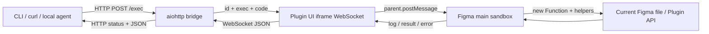

# figmosha2 심층 분석 보고서

> 조사 기준: 2026-08-27 (Asia/Seoul)  
> 대상: `code-kb/figmosha2`의 `.git/**` 제외 전 파일 15개  
> 기준 커밋: `547cefb4c90abaa1da68db5455b921cbf3f8a5b9` (`master`, tag `v2.1.0`)  
> 파일별 근거: [figmosha2-file-inventory.md](inventories/figmosha2-file-inventory.md)

## 1. 결론 요약

figmosha2는 **로컬 HTTP 요청으로 Figma Plugin API JavaScript를 실행하는 얇은 양방향 브리지**다. Python CLI/HTTP 서버가 요청 ID를 붙여 Figma plugin UI의 WebSocket으로 보내고, plugin main sandbox가 `new Function`으로 실행한 뒤 결과와 로그를 같은 ID로 되돌린다. 선택·트리·검색·텍스트·variant·복제·삭제·library component import용 CLI와 20개 helper가 있어, 한 개발자가 열어 둔 Figma 파일을 터미널 또는 에이전트에서 빠르게 조사·수정하는 내부 도구로는 작고 강력하다. 근거는 `code-kb/figmosha2/bridge.py:229-327`, `code-kb/figmosha2/plugin/ui.html:46-135`, `code-kb/figmosha2/plugin/code.js:319-355`다.

그러나 이 프로젝트는 **UX 분석 엔진이나 design-to-code/code-to-design 제품이 아니다**. Figma 노드를 구조화된 중간 표현으로 정규화하지 않고, React/Vue/Swift 등 레거시 코드를 읽거나 수정하지 않으며, 코드베이스를 Figma로 변환하는 parser도 없다. 가능한 범위는 “호출자가 직접 작성한 Plugin API 스크립트”와 소수의 편의 명령뿐이다 (`code-kb/figmosha2/figmosha.py:182-334`, `code-kb/figmosha2/plugin/code.js:96-315`). 따라서 통합 서비스에서는 **로컬 plugin transport, 상관관계 ID, 상태 진단, 일부 helper**를 재사용하고, 의미 모델·코드 분석/생성·권한·감사·직렬화 계층은 새로 설계해야 한다.

가장 큰 기술·제품 위험은 다음과 같다.

1. `/exec`가 인증·승인·allowlist 없이 열린 파일 안에서 임의 JavaScript를 실행한다. loopback/Origin/Host 방어는 웹 페이지 공격면을 줄이지만 로컬 프로세스, `Origin: null` WebSocket 선점, LAN 노출, 오조작에는 방어가 없다 (`code-kb/figmosha2/bridge.py:35-69,144-176,229-258`; `code-kb/figmosha2/README.md:108-110`).
2. `PENDING`은 FIFO 큐가 아니라 동시 in-flight map이고 plugin 쪽에도 명시적 직렬화가 없다. 여러 변형 요청은 순서·원자성이 보장되지 않고, 전역 `CURRENT_PRINT`가 실행 간 섞일 수 있다 (`code-kb/figmosha2/bridge.py:25-27,249-290`; `code-kb/figmosha2/plugin/code.js:21-23,319-355`).
3. “유료 정책 회피”를 공개 제품 목표로 삼는 것은 코드 라이선스와 별개로 매우 높은 플랫폼 정책 위험이다. 2026-08-27 확인한 Figma 공식 심사 지침은 paid-offering workaround, 공식 MCP 밖의 programmatic AI access, Figma API 재배포를 승인하지 않을 수 있다고 밝힌다. plugin 실행 자체도 plan/seat와 파일 권한의 영향을 받고 design 파일에서 plugin 사용에는 `can edit`가 필요하다. 이 브리지는 **합법적으로 부여된 접근권한을 다른 실행 채널로 자동화할 뿐 권한·좌석을 제거하지 않는다**. [Figma Developer Terms](https://www.figma.com/legal/developer-terms/), [Plugin and widget review guidelines](https://help.figma.com/hc/en-us/articles/360039958914-Plugin-and-widget-review-guidelines), [Use plugins in files](https://help.figma.com/hc/en-us/articles/360042532714-Use-plugins-in-files), [Guide to inspecting](https://help.figma.com/hc/en-us/articles/22012921621015-Guide-to-inspecting).

## 2. 조사 범위, 기준점, 라이선스

| 항목 | 확인 결과 | 근거 |
|---|---|---|
| Git 기준점 | `547cefb4c90abaa1da68db5455b921cbf3f8a5b9`, tag `v2.1.0`, branch `master`; 마지막 커밋 시각 2026-08-18T15:47:00+03:00 | 로컬 `git rev-parse HEAD`, `git describe --tags`; `code-kb/figmosha2/CHANGELOG.md:11-12` |
| 원격 | `https://github.com/denysosadchyi/figmosha2.git` | 로컬 `git remote -v` |
| 라이선스 | core source는 MIT, Copyright © 2026 Denys Osadchyi. 단, UI에 embedded된 Solar/480 Design SVG 3개는 source와 changelog가 CC BY 4.0으로 고지 | `code-kb/figmosha2/LICENSE:1-20`; `plugin/ui.html:38-44`; `CHANGELOG.md:72-75` |
| 조사 파일 | 15개, 109,430 bytes; 텍스트 14개 2,518 물리행/2,082 비공백행, PNG 1개 | `docs/code-kb-analysis/inventories/figmosha2-file-inventory.md` |
| 원본 상태 | 조사·검증 전후 `code-kb/figmosha2`의 `git status --short`는 빈 결과 | 로컬 검증 명령 |
| 누락된 배포 메타데이터 | `requirements.txt`, `pyproject.toml`, `package.json`, lockfile, CI workflow가 15개 파일에 없음 | `git ls-files`; inventory 전수 목록 |

MIT는 figmosha2 core source의 사용·수정·배포 허가일 뿐 Figma 서비스, 문서 데이터, Plugin API 또는 유료 기능에 대한 권리를 부여하지 않는다. 또한 `plugin/ui.html`에 직접 포함된 status SVG는 “Solar icon set by 480 Design — CC BY 4.0”으로 고지되어 있으므로, 이를 재사용·변형·배포할 때는 [CC BY 4.0](https://creativecommons.org/licenses/by/4.0/)의 attribution·license link·변경 표시 요건을 별도로 보존해야 한다 (`code-kb/figmosha2/plugin/ui.html:38-44`; `CHANGELOG.md:72-75`). 통합 시 `THIRD_PARTY_NOTICES`를 만들거나 해당 SVG를 자체 자산으로 교체해야 한다. `plugin/icon.png`의 제작자·license provenance는 저장소 안에서 확인되지 않았다. Figma Developer Terms도 Developer Resources 사용과 Figma Services 접근 계약을 별개로 둔다. 공개·상용 통합 전에는 법률·보안·플랫폼 검토가 필요하며, 이 보고서는 법률 자문이 아니다.

## 3. 목적과 실제 사용자 흐름

### 3.1 의도된 사용자

- 터미널, Claude Code, curl 또는 다른 HTTP client에서 현재 열린 Figma 파일을 조사·수정하려는 개발자 (`code-kb/figmosha2/README.md:1-15`).
- 반복적인 노드 탐색, 텍스트 변경, variant 전환, token binding, component import를 Plugin API로 자동화하려는 design-system 작업자 (`code-kb/figmosha2/README.md:58-82`).
- Figma Desktop에서 development plugin을 한 번 수동 import하고 매 세션 수동 실행할 수 있는 사용자 (`code-kb/figmosha2/README.md:153-174`).

### 3.2 정상 흐름

1. 사용자가 Python venv를 만들고 `aiohttp`를 설치한다. Unix 계열에서는 `start-bridge.sh`, Windows에서는 `start-bridge.ps1`로 `bridge.py`를 실행한다 (`code-kb/figmosha2/README.md:179-190`; `start-bridge.sh:1-27`; `start-bridge.ps1:12-76`).
2. 사용자가 Figma Desktop에서 `plugin/manifest.json`을 development plugin으로 import하고 수동 실행한다. plugin main은 220×28 UI iframe을 열고, UI는 `ws://localhost:8787/plugin`에 연결한다 (`code-kb/figmosha2/plugin/code.js:1`; `plugin/ui.html:46-82`; `plugin/manifest.json:1-12`).
3. CLI가 `POST /exec`로 `{code, timeout}`을 보낸다. bridge는 UUID request ID, Future, 로그 배열, 시작 시각을 `PENDING`에 넣고 WebSocket으로 `{id,type:"exec",code}`를 보낸다 (`code-kb/figmosha2/figmosha.py:75-100`; `bridge.py:245-261`).
4. UI iframe은 WebSocket 메시지를 Figma main sandbox로 `parent.postMessage`한다 (`code-kb/figmosha2/plugin/ui.html:84-97`).
5. main sandbox는 async IIFE를 `new Function("figma","print","h",...)`로 실행한다. `print`는 log message를 내보내고, return 값은 표시 문자열과 JSON-safe 값으로 이중 직렬화한다 (`code-kb/figmosha2/plugin/code.js:3-17,319-352`).
6. UI iframe이 main의 log/result/error를 WebSocket으로 bridge에 전달하고, bridge가 ID에 해당하는 Future와 로그를 완성한다 (`code-kb/figmosha2/plugin/ui.html:120-133`; `bridge.py:195-215`).
7. bridge가 성공 200, 실행 오류 500, 미연결 503, timeout 504 등으로 응답하고 CLI가 결과·힌트·stack·로그를 출력한다 (`code-kb/figmosha2/bridge.py:229-291`; `figmosha.py:103-122`).

### 3.3 사용자에게 보이는 제약

- plugin이 연결된 **단일 열린 파일**만 대상으로 한다. 파일 전환 후 다시 실행해야 한다 (`code-kb/figmosha2/README.md:97-104,313-319`).
- 활성 plugin instance는 한 개뿐이며 두 번째 연결은 1008 `Slot busy`로 거절된다 (`code-kb/figmosha2/bridge.py:156-174`; `plugin/ui.html:105-117`).
- Figma가 닫혔거나 plugin 창을 종료하면 사용할 수 없고 headless renderer가 아니다 (`code-kb/figmosha2/README.md:99-104`).
- 공식 Figma 문서상 plugin은 사용자가 수동 실행하며 한 번에 하나만 실행된다. figmosha2는 `figma.closePlugin()`을 호출하지 않아 사용자가 닫을 때까지 실행 상태를 유지하는 방식이다 (`code-kb/figmosha2/plugin/code.js:1-355`; [How Plugins Run](https://developers.figma.com/docs/plugins/how-plugins-run/)).

## 4. 비용·호출 제약 대체 메커니즘

### 4.1 무엇을 기술적으로 대체하는가

figmosha2의 핵심은 REST API나 공식 Dev Mode MCP의 인증 endpoint를 속이는 것이 아니라, **사용자가 이미 실행 권한을 가진 interactive plugin runtime을 별도 실행 채널로 선택**하는 것이다.

```text
REST/MCP 방식: client → Figma cloud API/MCP → file data/tool result
figmosha2 방식: local client → local HTTP/WS → user-run plugin → open file Plugin API
```

| REST/MCP 쪽 제약 | figmosha2 경로의 변화 | 코드 근거 |
|---|---|---|
| REST access token 발급·전송 | Figma REST token을 전혀 사용하지 않음 | Python transport에는 local host/port만 있고 auth header가 없음 (`figmosha.py:75-100`). |
| REST endpoint별 rate limit·schema | REST endpoint를 호출하지 않고 caller-supplied Plugin API JS를 실행 | `bridge.py:245-255`, `plugin/code.js:334-345` |
| 공식 MCP의 고정 tool surface | `figma` object 전체와 `h.*`를 넘겨 Plugin API 범위에서 임의 script 가능 | `plugin/code.js:96-315,334-338` |
| 공식 MCP endpoint 호출량·quota·remote round trip | 공식 MCP server를 거치지 않고 local loopback 왕복 | `bridge.py:330-356`, `plugin/ui.html:46` |
| cloud에서 file을 fetch하는 batch 방식 | 사용자가 현재 열어 plugin을 실행한 document를 직접 조작 | `README.md:97-104` |

따라서 code상 확정할 수 있는 것은 **Figma REST 및 official MCP endpoint 호출 수가 0이고, 해당 transport의 호출 quota를 직접 소비하지 않는다**는 점이다. 금전 절감 폭과 전체 token 비용은 측정되지 않았다. Claude/Codex 등 caller의 LLM inference token, Figma eligible seat/plan, local compute, 운영·support·정책 검토 비용은 그대로 남는다. 저장소의 5/30/150ms 성능 수치도 benchmark 근거가 없어 비용 모델에 사용할 수 없다 (`README.md:7`).

### 4.2 무엇을 우회하지 못하는가

| 남는 경계 | 이유 |
|---|---|
| Figma 계정 인증과 file ACL | plugin은 사용자가 열 수 있는 파일 안에서만 실행된다. 권한 상승 코드는 없다. |
| plan/seat와 `can edit` | 공식 도움말상 plugin 가능 product는 plan/seat에 따라 다르고 design file plugin 사용에는 `can edit`가 필요하다. |
| Plugin API/manifest permission | team library 등은 manifest permission과 사용자의 library 접근권한을 그대로 요구한다 (`manifest.json:7-8`). |
| 수동 실행·열린 앱 | 사용자가 plugin을 실행해야 하며 Figma Desktop과 열린 파일이 필요하다 (`README.md:99-104,169-174`). |
| unopened/cloud 전체 파일 batch | file browser, 다른 파일, headless fetch 기능이 없다. |
| comments/account/community publishing | README도 Plugin API 밖 영역으로 명시한다 (`README.md:97-103`). |
| Figma Developer Terms·Community review | 실행 채널이 local이어도 Developer Resources와 integration의 정책 적용은 사라지지 않는다. |
| 데이터 보호 의무 | 결과와 로그로 사용자 데이터를 처리하면 공개 integration의 동의·보안·privacy 의무가 남는다. |

즉 “비용 제약 우회”는 **공식 cloud API/MCP 대신 사용자가 직접 실행하고 현재 파일 접근권한 범위에서 동작하는 local Plugin API를 쓰는 아키텍처 대체**로만 표현해야 한다. Plugin API가 제공된다는 사실은 이 raw-executor integration이나 배포 형태가 Figma 정책상 승인됐다는 뜻이 아니다. 결제 통제를 침해하거나 권한을 속이는 기능은 구현되어 있지 않으며 그런 기능을 추가해서도 안 된다.

### 4.3 내부 도구와 공개 서비스의 차이

- 한 사용자가 자신의 편집 가능한 파일에 development plugin을 직접 import/run하는 내부 도구는 기술적으로 현실적이다.
- 조직 배포는 private plugin plan과 관리자 정책을 확인해야 한다. private organization plugin은 공식 도움말상 Organization/Enterprise 범위다. [Create private plugins for an organization](https://help.figma.com/hc/en-us/articles/4404228629655-Create-private-plugins-for-an-organization).
- Community 공개 plugin은 paid-offering workaround, 공식 MCP 밖 programmatic AI access, API sublicensing/distribution, 사용자 인지 없는 변경에 대한 심사 위험이 매우 높다. raw `/exec`를 공개 서비스로 포장하는 접근은 부적합하다.
- 제품 목표는 “라이선스 회피”가 아니라 **정당한 권한을 가진 사용자의 명시적 동의 아래, 로컬 분석·왕복 동기화가 Figma REST/official MCP endpoint와 그 quota에 의존하지 않게 하는 것**으로 재정의해야 한다.

## 5. 기술 스택과 의존성

| 계층 | 기술 | 직접 의존성 | 평가 |
|---|---|---|---|
| CLI | Python stdlib `argparse`, `urllib`, `json`, `os`, `sys` | 외부 package 없음 | 가볍지만 package entry point가 없어 `python figmosha.py`로 실행 (`figmosha.py:37-53,344-455`). |
| Bridge | Python 3.10+ async, `aiohttp.web`, aiohttp WebSocket | `aiohttp` | `web.Application` 한 process와 전역 상태 (`bridge.py:17-32,321-356`). `WebSocketResponse | None` 문법 때문에 3.10+ 주장은 타당. |
| Plugin main | Figma Plugin API, plain JavaScript | Figma sandbox | bundling/TypeScript 없이 manifest가 `code.js`를 직접 로드 (`manifest.json:4-6`). |
| Plugin UI | HTML/CSS/Browser WebSocket | browser API | iframe만 network를 담당하고 main과 message passing (`ui.html:37-135`). |
| Python test | pytest, aiohttp test utilities | `pytest`, `aiohttp` | fake plugin으로 실제 test HTTP/WS round trip 정의 (`tests/test_bridge.py:1-22,42-89`). |
| JS test | Node.js 내장 `fs`, `path` | Node, npm package 없음 | 자체 `check()` harness 20개 (`tests/helpers.test.js:7-48,50-104`). |

설치 버전이 pin되지 않았다. README의 `pip install aiohttp`와 테스트의 `pip install pytest aiohttp`만 있어 dependency/Python 조합이 바뀌면 재현성이 달라질 수 있다 (`README.md:179-188,374-382`; `tests/test_bridge.py:7-9`).

## 6. 설치·실행·구성 분석

### 6.1 수동 설치

```bash
python3 -m venv venv
./venv/bin/pip install aiohttp
./venv/bin/python bridge.py
```

그 뒤 Figma Desktop에서 `plugin/manifest.json`을 import하고 `Figmosha Bridge`를 실행한다. Python test까지 실행하려면 `pytest`도 별도 설치한다 (`README.md:169-198,374-382`).

### 6.2 실행기 차이

| 항목 | `start-bridge.sh` | `start-bridge.ps1` |
|---|---|---|
| 대상 | macOS/Linux/WSL을 문서상 지원 | native Windows |
| Python | `./venv/bin/python` 고정 | `venv\Scripts\python.exe`, 없으면 PATH `python` |
| process | 기존 `figmosha-bridge` tmux session 종료 후 새 detached session | port listener가 있으면 no-op; `-Restart/-Stop`이면 PID 강제 종료 후 hidden process |
| 추가 도구 | bash, tmux, curl, tee | PowerShell, `netstat`, `Start-Process`, `Stop-Process` |
| 로그 | `/tmp/figmosha-bridge.log` | `bridge.out.log`, `bridge.err.log` |
| readiness | `/status`를 최대 10회, 실패 사이 0.1초 sleep. connection-refused라면 명목상 약 1초지만 `curl`에 connect/total timeout이 없어 nonresponsive listener에서는 wall-clock 상한이 없음 | 2초 sleep 후 listener PID 확인; HTTP service identity는 확인하지 않음 |
| 위험 | tmux 부재 시 실패; 1초가 느린 system에 짧음 | PID가 bridge인지 검증하지 않아 해당 port의 다른 process를 종료할 수 있음 |

근거: `code-kb/figmosha2/start-bridge.sh:1-27`, `start-bridge.ps1:12-76`.

### 6.3 host/port 설정의 단절

- CLI는 `FIGMOSHA_HOST`/`FIGMOSHA_PORT`와 global `--host`/`--port`를 지원한다 (`figmosha.py:45-50,347-350,433-435`).
- bridge는 `--host`/`--port`를 지원하고 기본 `127.0.0.1:8787`이다 (`bridge.py:330-356`).
- plugin UI 주소는 `ws://localhost:8787/plugin`으로 hardcode되고 manifest allowedDomains도 8787만 허용한다 (`plugin/ui.html:46`; `plugin/manifest.json:9-11`).

따라서 custom port는 **bridge와 CLI만 바꿔서는 end-to-end 동작하지 않는다**. host도 같은 문제를 가진다. plugin UI는 언제나 hostname `localhost`로 접속하므로 bridge가 `localhost`를 통해 도달할 수 없는 특정 LAN-address-only bind에서는 CLI가 그 IP를 사용해도 plugin 연결이 실패한다. `0.0.0.0` bind는 loopback도 받으므로 연결 자체는 가능하지만 보안 경계를 크게 넓힌다. IPv6-only bind의 성공 여부도 local `localhost` resolution과 listener family에 달려 있다. UI를 IP/다른 hostname으로 바꾸면 manifest allowedDomains도 함께 바꾸고 재import해야 한다 (`plugin/ui.html:46`; `plugin/manifest.json:9-11`; `bridge.py:333-356`). Windows 실행기의 `-Port` 역시 bridge만 바꾸므로 단독 사용 시 plugin 연결을 깨뜨린다 (`start-bridge.ps1:12-15,60-65`). 통합 시 bind address와 plugin connect address를 분리한 단일 설정에서 manifest/UI/client/server를 생성해야 한다.

### 6.4 readiness와 service identity

Unix launcher는 `/status`의 임의 2xx를 성공으로 보고, Windows launcher는 해당 port에 `LISTENING` PID가 있는지만 본다 (`code-kb/figmosha2/start-bridge.sh:11-20`; `start-bridge.ps1:33-36,67-74`). CLI `status`도 HTTP 200이면 exit 0이며 service/version magic을 검사하지 않는다 (`figmosha.py:127-130`). root endpoint에는 service/version이 있지만 readiness path가 사용하지 않는다 (`bridge.py:305-318`). 따라서 같은 port의 다른 service를 Figmosha로 오인할 수 있다. 통합 시 `/status`에 service ID, protocol version, instance ID를 넣고 launcher·`status`·`doctor`가 모두 이를 검증해야 한다. Unix probe에는 `curl --connect-timeout`과 `--max-time`도 설정해야 한다.

## 7. 아키텍처와 데이터 흐름



| 구성요소 | 상태/책임 | 중요한 경계 |
|---|---|---|
| CLI/HTTP client | code 입력, timeout, 결과 표현 | trusted local caller로 간주하며 인증정보가 없음 |
| `bridge.py` | HTTP·WS routing, request ID/Future, guard, liveness, hint | Figma 내용을 직접 모르며 단일 global plugin socket/in-flight map 보유 |
| `plugin/ui.html` | browser WebSocket, status, reconnect, ping/pong, 중계 | browser API 가능, Figma scene 직접 접근 불가 |
| `plugin/code.js` | Figma scene/API, arbitrary JS, helper, 직렬화 | 실행 code에 사실상 manifest 전체 권한 제공 |
| Figma file/library | 읽기·쓰기 대상 | plan/seat/file ACL/plugin permission이 최종 권한 경계 |

## 8. HTTP·WebSocket protocol 전체 표

### 8.1 Endpoint

| method/path | 입력 | 성공 | 오류/상태 | 구현 |
|---|---|---|---|---|
| `GET /` | 없음 | service=`figmosha-bridge`, version=`2.0`, endpoint banner | guard 실패 403 | `bridge.py:305-318,323` |
| `GET /status` | 없음 | `{plugin_connected, pending}` | guard 실패 403 | `bridge.py:294-302,324` |
| `POST /exec` | JSON `{code: string, timeout?: number}` | 200 `{ok:true,result,value,logs,elapsed_ms}` | invalid JSON/빈 code 400; plugin 미연결 503; script/send/disconnect 500; timeout 504 | `bridge.py:229-291,325` |
| `GET /plugin` upgrade | WebSocket; plugin UI는 `Origin:null` | heartbeat 20초, frame max 16 MiB | hostile Origin 403; 두 번째 live plugin 1008 | `bridge.py:144-226,326` |

`web.Application(client_max_size=16 MiB)`와 WebSocket `max_msg_size=16 MiB`가 있으나 이는 각각 inbound HTTP body와 plugin→bridge frame 제한이다 (`code-kb/figmosha2/bridge.py:153,321-327`). outbound response 및 누적 로그 총량 제한은 없다.

### 8.2 WebSocket message

| 방향 | `type` | 필드 | 처리 |
|---|---|---|---|
| bridge → UI | `exec` | `id`, `code` | main sandbox로 즉시 전달 (`bridge.py:255`; `ui.html:90-93`) |
| bridge → UI | `ping` | 없음 | 연결 선점 검사; UI가 `pong` 응답 (`bridge.py:119-141`; `ui.html:93-97`) |
| UI → bridge | `hello` | `version=2.0` | bridge는 로그만 남김 (`ui.html:78-82`; `bridge.py:197-203`) |
| UI → bridge | `pong` | 없음 | `PLUGIN_LAST_SEEN` 갱신으로 생존 판정 |
| UI → bridge | `log` | `id`, `text` | 해당 `PENDING[id].logs`에 append (`plugin/code.js:323-330`; `bridge.py:211-212`) |
| UI → bridge | `result` | `id`, `text`, `value` | Future 완료, HTTP 200 변환 |
| UI → bridge | `error` | `id`, `text`, `stack` | Future 완료, hint 부착, HTTP 500 변환 |
| bridge → 새 UI | `error` | `text` | 이미 live plugin이 있을 때 안내 후 1008 close (`bridge.py:156-164`) |

protocol schema/version negotiation, capability handshake, authentication, replay 방지, message signature는 없다. `hello.version`은 표시만 하므로 호환성을 강제하지 않는다.

## 9. CLI 기능 전체 표

`build_parser()`는 12개 subparser 이름을 만든다. `import-component`와 `icomp`가 같은 handler를 쓰므로 고유 동작은 11개다 (`code-kb/figmosha2/figmosha.py:344-412,437-450`).

| 명령 | 읽기/쓰기 | 생성하는 동작 | 옵션·반환 | 한계/주의 |
|---|---|---|---|---|
| `status` | 읽기 | `GET /status` | JSON 출력; HTTP 200이면 exit 0 | plugin socket이 열렸는지만 보며 ping health와 Figmosha service/protocol identity를 확인하지 않음 (`figmosha.py:127-130`) |
| `doctor` | 읽기 | status → `1+1` round trip → 파일/페이지 정보 | 각 단절 지점 fix 출력 | 마지막 파일정보 query 실패는 명시적으로 fail 처리하지 않고 0 반환 가능 (`figmosha.py:137-179`) |
| `sel` | 읽기 | `return h.sel()` | 선택 전체 id/name/type/w/h/chars | 별도 선택이 없으면 빈 배열 (`figmosha.py:133-134`; `plugin/code.js:233-241`) |
| `exec CODE` | 양방향 | 임의 JS | positional, `--file/-f`, `--stdin`, `--timeout/-t`, `--raw` | file I/O 오류와 성공 response의 malformed JSON을 잡지 않음 (`figmosha.py:182-193`) |
| shorthand `figmosha "JS"` | 양방향 | 첫 인자가 알려진 command가 아니면 `exec` 삽입 | backward compatibility | 첫 인자가 global flag이면 shorthand 변환 대상이 아님 (`figmosha.py:415-425`) |
| `tree ID` | 읽기 | `h.dumpTree(resolve(ID), opts)` | `--depth`, `--no-size`, `--no-text`, `--layout` | 기본 depth 99, recursive 전체 문자열 생성 (`figmosha.py:196-208`) |
| `find ID FILTER` | 읽기 | descendant `findAll` 후 요약 map | `name=`, `name~`, `type=`, `text=`, `text~` | `=`/`~` 첫 위치가 mode 결정; 복합조건·root 자체 match 없음 (`figmosha.py:211-253`) |
| `text ID TEXT` | 쓰기 | TEXT 확인, font load, characters 변경 | before/after 반환 | mixed-font 거부; built-in command가 `figma.commitUndo()`를 호출하지 않아 per-command undo boundary와 실제 host undo granularity가 미검증, confirm 없음 (`figmosha.py:256-265`; `plugin/code.js:193-200`) |
| `variant ID P=V...` | 쓰기 | INSTANCE `setProperties` | applied/current 반환 | 같은 key 반복 시 마지막 값; 빈 key/value 검증 없음 (`figmosha.py:268-286`) |
| `clone ID` | 쓰기 | clone 후 인접 좌표·zoom | 방향, `--gap`, `--name` | 방향 flag가 mutually exclusive가 아니며 여러 개면 fixed loop의 마지막 참 값이 승리; auto-layout parent에서는 좌표 의도가 제한될 수 있음 (`figmosha.py:289-305`) |
| `rm ID...` | 쓰기/파괴 | 순서대로 `remove()` | removed 목록 | atomic하지 않음. 뒤 ID가 없으면 앞 node는 이미 삭제된 뒤 오류 (`figmosha.py:308-323`) |
| `import-component` / `icomp` | 쓰기 | library key import → instance → current page append → zoom | component/name/size 반환 | library/network/permission 의존; placement·collision policy 없음 (`figmosha.py:326-334`) |

공통 `--timeout/-t`와 `--raw`는 `status`를 제외한 명령에 붙는다 (`figmosha.py:339-341`). global `--host/--port`는 argparse 구조상 subcommand 앞에 둬야 한다. `_emit()` 일반 mode는 `result` 문자열만 출력하며 `value`를 직접 활용하려면 `--raw`가 필요하다 (`figmosha.py:103-122`).

## 10. Plugin helper 전체 표

helper는 정확히 20개다 (`code-kb/figmosha2/plugin/code.js:96-315`).

| helper | 분류 | 동작 | 제한·오류 |
|---|---|---|---|
| `bF(node,idx,varOrId)` | 쓰기/token | fill paint deep copy 후 color variable binding | mixed/no fills, bad index, variable 미발견 거부 (`code.js:81-106`) |
| `bS(node,idx,varOrId)` | 쓰기/token | stroke paint variable binding | `bF`와 같은 제한 (`code.js:108-117`) |
| `bN(node,prop,varOrId)` | 쓰기/token | `node.setBoundVariable(prop,v)` | property/variable type 사전검증 없음 (`code.js:119-125`) |
| `findByName(root,name)` | 읽기 | exact-name 첫 descendant | container API 필요 (`code.js:127-130`) |
| `findAllByName(root,name)` | 읽기 | exact-name descendants | 큰 tree O(N) (`code.js:132-135`) |
| `dumpTree(node,opts)` | 읽기 | name/type/id/size/text/layout indented string | recursive, 기본 maxDepth 99, 전체 문자열 memory 보유 (`code.js:137-164`) |
| `withFonts(root,asyncFn)` | 읽기+준비 | single-font TEXT의 unique font를 병렬 load 후 callback | mixed-font는 **load하지 않고** warning만 출력 (`code.js:166-190`) |
| `setText(node,text)` | 쓰기 | single font load 후 characters 변경 | mixed-font 즉시 오류; per-range 변경 없음 (`code.js:193-200`) |
| `cloneNext(node,opts)` | 쓰기 | clone, same parent append, 상하좌우 좌표 이동 | auto-layout parent semantics, null parent, direction 오타 검증 없음 (`code.js:202-215`) |
| `variant(instance,props)` | 쓰기 | `setProperties` wrapper | INSTANCE type 검증 없이 Figma 오류 전파 (`code.js:217-221`) |
| `variantsOf(instance)` | 읽기 | main component와 component set의 current/groups/all | main 없으면 null, set 아니면 groups/all null (`code.js:223-231`) |
| `sel()` | 읽기 | current selection 요약 | TEXT만 chars 포함; paint/style/constraints 없음 (`code.js:233-241`) |
| `hex(value)` | 순수 변환 | `#RGB`/`#RRGGBB` → 0..1 RGB | alpha hex 미지원, invalid 값 오류 (`code.js:52-65,243-245`) |
| `solid(value,opacity?)` | 순수 생성 | 단일 SOLID paint array | opacity range 검증 없음 (`code.js:246-251`) |
| `frame(parent,opts)` | 쓰기/build | frame 생성, append→layout→resize→hug→spacing/padding→fill/radius | option schema/type 검증과 real-Figma test 없음 (`code.js:253-296`) |
| `resolve(idOrAlias)` | 읽기 | `page`, 첫 `sel`, node ID async resolve | 빈 selection 오류; `sel`은 여러 선택 중 첫 node만 (`code.js:298-308`) |
| `node(id)` | 읽기 | `getNodeByIdAsync` 단축 | null 가능, 별도 오류 없음 (`code.js:310-311`) |
| `var_(idOrKey)` | 읽기/import | local ID 시도 후 library key import fallback | import 실패를 null로 삼켜 원인을 잃음 (`code.js:25-50,312`) |
| `importComp(key)` | import | library component import | permission/network 오류 전파 (`code.js:313`) |
| `importVar(key)` | import | library variable import | local ID resolution 없이 key 전용 (`code.js:314`) |

내부 `resolveVar()`는 `VariableID:` prefix를 local variable로 보고, 그 외 문자열은 local lookup을 예외 보호한 뒤 library key import를 시도한다 (`code-kb/figmosha2/plugin/code.js:25-50`). paint freeze와 font load라는 반복 실수를 helper로 캡슐화한 점은 재사용 가치가 높다.

## 11. Manifest 기능·권한 표

| 필드 | 값 | 실제 사용/평가 |
|---|---|---|
| `name`, `id`, `api` | `Figmosha Bridge`, `figmosha-bridge-dev`, `1.0.0` | development plugin 식별자. product release `v2.1.0`과 별도이며 version field 없음 |
| `main`, `ui` | `code.js`, `ui.html` | main scene 접근과 UI network 접근 분리 |
| `editorType` | `figma`, `figjam` | 문서는 Figma Design 중심. variables/component helper의 FigJam 호환성 미검증 |
| `permissions` | `teamlibrary`, `activeusers`, `fileusers`, `currentuser` | built-in helper가 직접 쓰는 것은 team library/import 계열. 나머지는 arbitrary exec에서 가능하지만 최소권한 관점에서 과다할 수 있음 |
| `networkAccess.allowedDomains` | `http://localhost:8787`, `ws://localhost:8787` | UI가 실제 쓰는 것은 WS. port hardcode |
| `networkAccess.reasoning` | local CLI bridge 설명 | 외부 연결 의도를 문서화 |
| 누락: `documentAccess` | 없음 | `CLAUDE.md:136`은 dynamic-page documentAccess라고 주장하지만 manifest에는 선언 없음 |

전체 근거: `code-kb/figmosha2/plugin/manifest.json:1-13`.

## 12. Figma 읽기·쓰기·양방향 능력

| 요구 능력 | 현재 수준 | 가능한 것 | 빠진 것 |
|---|---|---|---|
| Figma UX 구조 읽기 | 부분 지원 | selection, subtree, name/type/text 검색, 크기, auto-layout 요약, variant; arbitrary exec로 추가 조회 | canonical schema, styles/effects/constraints/prototype interaction/variables의 일관된 extractor, pagination/cache 없음 |
| 디자인 수정 | 강함(저수준) | text, variant, clone, remove, component import, frame, token binding, arbitrary mutation | transaction, dry-run, diff, preview, confirmation, rollback, built-in command별 explicit `commitUndo()` boundary, policy engine 없음 |
| Figma → code | transport만 지원 | JSON-serializable result와 export bytes를 caller가 처리 가능 | React/Vue/Svelte/SwiftUI/HTML/CSS generator, asset pipeline, component mapping, legacy source patch 없음 |
| code → Figma | 부분 지원 | JS file을 `exec --file`로 실행해 node/frame/component 생성 | HTML/CSS/JSX/Swift parser, layout inference, code AST→design IR, incremental sync 없음 |
| 양방향 round trip | 기술적으로 지원 | 한 session에서 read/write tool call, result/log/error 회신 | semantic identity, change tracking, conflict resolution, live sync 없음 |
| Figma Web | 저장소 기준 미지원/미검증 | WebSocket/UI 기술 자체는 browser 기반 | README는 Desktop development plugin만 지원; Web import/run/setup test 없음 (`README.md:153-172`) |
| Figma Desktop | 지원 의도 명확 | manual development plugin + local bridge | real Figma E2E test 없음 |

사용자 목표인 “Figma UX 분석 후 레거시 code 구현, 반대로 codebase로 Figma design”에서 figmosha2가 제공하는 것은 마지막-mile 실행 channel이다. 분석·mapping·code generation·repository modification은 통합 서비스가 별도로 제공해야 한다.

## 13. 주요 파일과 심볼 책임

| 파일/심볼 | 책임 | 의존/호출 관계 |
|---|---|---|
| `bridge.py::_guard` | Host/Origin 검사 | 모든 HTTP handler와 plugin WS handshake (`bridge.py:35-69,147,230,295,306`) |
| `bridge.py::ERROR_HINTS/find_hint` | error substring→복구 hint | script error HTTP 500 생성 (`bridge.py:72-109,271-283`) |
| `bridge.py::PENDING` | ID→Future/logs/t0 registry | `exec_handler` 생성/제거, WS handler resolve (`bridge.py:25,205-215,249-290`) |
| `bridge.py::_incumbent_answers` | 기존 plugin ping liveness | 새 plugin single-slot 유지/교체 (`bridge.py:119-174`) |
| `bridge.py::plugin_ws_handler` | plugin lifecycle/message correlation | `_guard`, `_incumbent_answers`, `_fail_pending` |
| `bridge.py::exec_handler` | validation, WS dispatch, timeout, HTTP response | global `PLUGIN_WS`, `PENDING`, `find_hint` |
| `figmosha.py::_request/_exec/_emit` | HTTP transport와 출력 contract | 모든 CLI handler 기반 (`figmosha.py:75-122`) |
| `figmosha.py::cmd_*` | `json.dumps` escape JS template | bridge `/exec`, plugin `h.*` (`figmosha.py:127-334`) |
| `figmosha.py::build_parser/main` | parser·shorthand·dispatch | 12 parser name을 11 handler 동작에 연결 (`figmosha.py:344-455`) |
| `plugin/ui.html::connect` | fixed WS, status, reconnect, ping | bridge `/plugin` (`ui.html:46-118`) |
| `plugin/ui.html::window.onmessage` | main→WS 전달 | result/error/log을 bridge로 전송 (`ui.html:120-133`) |
| `plugin/code.js::safeStringify/asText` | raw/display result 직렬화 | exec 완료 message (`code.js:3-17,340-345`) |
| `plugin/code.js::HELPERS` | 20개 low-level operation | user code와 CLI-generated code가 호출 (`code.js:96-315`) |
| `plugin/code.js::figma.ui.onmessage` | arbitrary JS evaluator | UI exec를 받아 Figma API 호출 (`code.js:319-355`) |

## 14. 요청 큐·직렬화·수명주기

### 14.1 실제 구현

`PENDING`이라는 이름 때문에 queue처럼 보이지만 구현은 `dict[rid] = {future, logs, t0}`인 **동시 요청 registry**다. 각 HTTP 요청은 plugin에 즉시 전송되고, 도착한 `log/result/error`를 UUID로 상관시킨다 (`code-kb/figmosha2/bridge.py:25,205-215,249-290`). `/status.pending`은 대기열 길이가 아니라 완료되지 않은 registry 크기다 (`bridge.py:299-302`).

UI도 `exec`를 받자마자 main으로 보내며, main의 async `figma.ui.onmessage` handler에는 mutex·promise chain·FIFO queue가 없다 (`code-kb/figmosha2/plugin/ui.html:84-93`; `plugin/code.js:319-355`). Figma host의 실제 callback scheduling은 실환경 검증이 필요하지만 **application 차원의 직렬화 보장은 없다**.

### 14.2 동시성 위험

- 두 mutation이 같은 node를 바꾸면 arrival/scheduling 순서와 await 지점에 따라 interleave할 수 있다.
- `CURRENT_PRINT`는 exec-local이 아니라 global이다. 겹친 실행 중 `withFonts()` warning은 다른 실행의 print로 전달될 수 있고, 먼저 끝난 실행의 `finally`가 이를 no-op으로 바꿀 수 있다 (`code-kb/figmosha2/plugin/code.js:21-23,182-187,332-355`).
- 한 요청이 timeout돼도 plugin에 cancel message를 보내지 않는다. caller가 504를 받은 뒤 script가 계속 Figma를 변경할 수 있고, 늦은 response는 `PENDING`에서 빠져 버려진다 (`code-kb/figmosha2/bridge.py:205-209,260-266`).
- plugin handover 1초 동안 old socket으로 간 요청은 새 plugin으로 requeue되지 않고 `plugin reconnected mid-request`로 실패한다. 테스트 주석도 이를 명시한다 (`code-kb/figmosha2/tests/test_bridge.py:222-243`).
- silent incumbent를 challenger A/B가 거의 동시에 교체하면 둘 다 같은 `old`를 잡아 최대 1초 probe한 뒤, await 후 generation을 재확인하거나 lock을 잡지 않은 채 각각 `PLUGIN_WS = ws`를 실행할 수 있다 (`code-kb/figmosha2/bridge.py:144-174`). loser socket은 열린 stale 상태로 남고 winner가 닫혀도 자동 승격되지 않는다. 현재 test는 challenger 하나의 순차 handover만 다룬다.
- `exec_handler`는 `PENDING[rid]` 생성 뒤 send failure, `asyncio.TimeoutError`, 정상 result에서만 entry를 제거하며 task cancellation을 포괄하는 `finally`가 없다 (`bridge.py:249-290`). aiohttp가 client disconnect 때 handler를 취소하는지는 실행 설정에 따라 실험이 필요하지만, server shutdown/`CancelledError` 등 모든 exit path의 cleanup은 code상 보장되지 않는다.
- request count, log count, server-wide 실행 시간 제한과 backpressure가 없다.

통합 서비스는 사용자/file별 single-writer queue, read-only parallel lane, idempotency key, cancel/abort protocol, mutation transaction/undo group, per-request log sink를 추가해야 한다. Plugin connection 교체에는 `asyncio.Lock`과 generation recheck/loser close가 필요하고, pending entry는 `try/finally`로 회수해야 한다.

## 15. 오류·힌트·timeout 분석

### 15.1 오류 경로

| 상황 | 응답/행동 | 근거 |
|---|---|---|
| Host/Origin 거부 | 403 JSON, local client/plugin 안내 hint | `bridge.py:35-69` |
| plugin 미연결 | 503 `plugin not connected` | `bridge.py:234-238` |
| invalid JSON/빈 code | 400 | `bridge.py:240-247` |
| WS send 실패 | 500, pending 즉시 제거 | `bridge.py:254-258` |
| script exception | plugin error/stack → bridge 500 + hint + logs + elapsed | `plugin/code.js:346-352`; `bridge.py:271-283` |
| timeout | 504, pending 제거 | `bridge.py:260-266` |
| disconnect/reconnect | 모든 in-flight Future를 error로 resolve | `bridge.py:112-117,166-174,216-225` |
| CLI network failure | status 0과 `connection:` 오류 | `figmosha.py:75-92` |
| CLI normal/raw 출력 | logs/error/hint/stack은 stderr, raw JSON 선택 | `figmosha.py:103-122` |

### 15.2 Hint 범위

`ERROR_HINTS`는 13개 substring rule로 fill/stroke binding, frozen array, manifest permission, unloaded/missing font, appendChild 순서, variant property/value, deprecated/missing function을 다룬다 (`code-kb/figmosha2/bridge.py:72-109`). 첫 match만 반환하며 structured error code가 아니라 영어 message substring에 의존하므로 Figma 문구 변경·지역화·복합 오류에 취약하다. 인식하지 못한 오류에도 JSON `hint:null` key가 포함된다 (`bridge.py:273-280`).

### 15.3 입력 검증과 timeout 결함

- HTTP `timeout`은 `float()`만 적용하고 양수/유한값/최댓값을 검증하지 않는다. 문자열 변환 실패는 handler에서 잡지 않고, 음수·매우 큰 값도 policy 없이 전달한다 (`code-kb/figmosha2/bridge.py:249-261`).
- CLI timeout은 `int`지만 하한·상한이 없고 socket deadline을 server timeout보다 5초 길게 잡는다. changelog의 65초 고정 deadline 수정은 코드로 확인된다 (`figmosha.py:95-100,339-341`; `CHANGELOG.md:57-59`).
- timeout은 **취소가 아니라 caller의 기다림 종료**다. 장시간 mutation의 완료 여부를 caller가 알 수 없다.
- `request.json()` 결과가 object인지 검사하지 않아 array/null body는 `.get`에서 예외가 난다 (`bridge.py:240-249`).

## 16. 보안과 신뢰 경계

### 16.1 구현된 방어

- 정상 CLI entry인 `main()`은 기본 bind를 loopback `127.0.0.1`로 두고, loopback일 때 `Host`를 `localhost`, `127.0.0.1`, `[::1]`의 정확한 port로 제한한다 (`code-kb/figmosha2/bridge.py:330-348`). 단, module default `ALLOWED_HOSTS`는 빈 set이며 빈 set은 Host check를 끈다. `build_app()`은 이를 초기화하지 않으므로 app factory만 import/reuse하면 DNS-rebinding gate가 조용히 사라진다 (`bridge.py:29-32,51-56,321-327`).
- HTTP에 `Origin`이 있으면 거부해 일반 cross-origin fetch/CSRF를 막고, plugin WS에 한해 sandbox의 `Origin: null`을 허용한다 (`bridge.py:35-69,147-151`).
- HTTP body와 inbound WS frame에 16 MiB 한도를 둔다 (`bridge.py:153,321-327`).
- 두 번째 live plugin을 거절하고 half-open incumbent는 ping 후 교체한다 (`bridge.py:119-174`).
- CLI JS template 값은 `json.dumps`로 escape해 ID/text/filter 입력이 code syntax를 깨뜨릴 위험을 줄인다 (`figmosha.py:70-72,203-206,223-251,256-333`).

### 16.2 남은 위험

| 위험 | 심각도 | 분석 |
|---|---|---|
| 임의 Plugin API 실행 | 매우 높음 | `new Function`에 `figma`, `h`, `print`를 직접 주므로 허용된 file/library를 읽고 수정·삭제할 수 있다. OS shell RCE는 아니지만 열린 Figma document에는 사실상 code execution이다 (`plugin/code.js:334-345`). |
| 인증·사용자 동의 없음 | 매우 높음 | local token, session binding, per-request confirm, ACL 없음. README도 “no authentication beyond being on the machine”이라고 명시 (`README.md:106-110`). |
| `Origin:null` plugin impersonation | 높음 | 인증 handshake가 없어 hostile sandboxed iframe/local client가 null-origin WS로 먼저 slot을 차지하거나 code를 가로챌 가능성을 배제할 수 없다. legitimate incumbent가 live이면 ping 방어가 된다. |
| LAN bind | 매우 높음 | non-loopback bind 시 Host check를 끄며 도달 가능한 누구나 code를 실행할 수 있다고 warning (`bridge.py:344-348`). TLS도 없음. |
| 과도한 manifest permission | 높음 | `activeusers`, `fileusers`, `currentuser`는 built-in 기능에서 직접 쓰지 않는다. arbitrary exec가 접근하므로 최소권한 필요 (`manifest.json:7-8`). |
| 감사·복구 부재 | 높음 | caller identity, audit, redaction, mutation diff, rollback, delete confirmation이 없다. built-in write command는 `figma.commitUndo()`를 호출하지 않아 long-running plugin에서 per-command undo boundary가 구현·검증되지 않았고, `rm`도 비원자적이다. Figma host의 자동 undo 가능 여부와 granularity는 live test가 필요하다. |
| 로그/결과 유출·DoS | 높음 | document text/user data가 HTTP/log로 나올 수 있고 누적 log/outbound response cap/rate limit가 없다. cyclic object를 `print`하면 stringify 자체가 script error가 될 수 있다 (`plugin/code.js:323-330`). |
| launcher PID kill | 중간 | Windows `-Stop/-Restart`는 port listener identity 없이 `Stop-Process -Force` (`start-bridge.ps1:33-48`). |
| Host guard factory 결합 | 높음 | `main()`을 거치지 않고 `build_app()`을 reuse하면 `ALLOWED_HOSTS`가 빈 set이라 Host/DNS-rebinding check가 비활성화된다. tests도 Host case 하나 외에는 빈 set으로 실행한다 (`bridge.py:29-32,51-56,321-343`; `tests/test_bridge.py:29-39,118-125`). |
| readiness identity 부재 | 중간 | launcher와 CLI status가 service/version을 확인하지 않아 동일 port의 다른 listener/2xx service를 정상으로 오인할 수 있다. |
| third-party notice 누락 | 중간 | embedded Solar/480 Design SVG는 CC BY 4.0인데 root LICENSE는 MIT만 포함하고 `THIRD_PARTY_NOTICES`가 없다 (`plugin/ui.html:38-44`; `CHANGELOG.md:72-75`). |

### 16.3 플랫폼 정책·라이선스 적합성

내부 개발자 모드와 공개 제품은 분리 평가해야 한다.

| 배포 형태 | 적합성 | 이유 |
|---|---|---|
| 한 개발자의 local development plugin | 조건부 적합 | 사용자가 직접 import/run하고 권한 있는 file만 다룬다는 전제에서 생산성 도구로 유용. 그래도 조직 보안·데이터 정책과 Figma Terms 적용 |
| 조직 private plugin | 별도 plan/관리 검토 | private organization plugin은 Organization/Enterprise 기능이며 공개 review 면제와 Terms 면제는 다름 |
| Community 공개 plugin | 현 목표로는 매우 높은 부적합 위험 | paid workaround, 공식 MCP 외 programmatic AI access, API 재배포, 인지 없는 file 변경과 raw `/exec`가 직접 충돌할 소지 |
| 접근권한/seat 회피 수단 | 부적합 | plugin 가능한 제품은 plan/seat별로 다르고 design file 사용에는 `can edit`가 필요. 코드에 권한 상승 경로가 없으며 있어서도 안 됨 |

공식 근거: [Developer Terms](https://www.figma.com/legal/developer-terms/), [Community review guidelines](https://help.figma.com/hc/en-us/articles/360039958914-Plugin-and-widget-review-guidelines), [plugin seat/plan matrix](https://help.figma.com/hc/en-us/articles/360042532714-Use-plugins-in-files), [inspection and can-edit requirement](https://help.figma.com/hc/en-us/articles/22012921621015-Guide-to-inspecting). 외부 문서 확인일은 2026-08-27이다.

## 17. 테스트 커버리지와 검증 결과

### 17.1 이번 조사에서 실행한 검증

| 명령 | 결과 | 비고 |
|---|---|---|
| `node tests/helpers.test.js` | **20/20 check 통과, exit 0** | Node `v24.19.0`; hex/solid/frame/sel 직접 검증 |
| `python -m pytest -q -p no:cacheprovider` | **실행 불가: `No module named pytest`** | system Python 3.14.7에 pytest/aiohttp가 없고 dependency lock도 없음 |
| Python `ast.parse` | 통과 | `bridge.py`, `figmosha.py`, `tests/test_bridge.py` syntax |
| `node --check` | 통과 | `plugin/code.js`, `tests/helpers.test.js` syntax |
| manifest `json.loads` | 통과 | JSON syntax |
| PowerShell parser | 통과 | `start-bridge.ps1` syntax |
| `bash -n start-bridge.sh` | skip | 조사 Windows 환경에 bash 없음 |
| `python -B figmosha.py --help` | 통과 | 12 subparser 이름 확인 |

Python test는 fail이 아니라 **현재 환경에서 미실행**이다. 문서대로 dependency 설치 후 실행 가능하도록 작성됐지만 이번 조사에서 pass를 주장할 수 없다.

### 17.2 정의된 테스트 범위

`tests/test_bridge.py`에는 12개 test 함수가 있고 `test_find_hint`의 5개 parameter를 전개하면 **16 case**다 (`code-kb/figmosha2/tests/test_bridge.py:92-262`).

- local 허용, Origin/Host/cross-origin WS 거부: 4 case.
- plugin 미연결, exec round trip, error hint, timeout cleanup, disconnect cleanup: 5 case.
- live plugin slot 유지와 silent plugin handover: 2 case.
- hint substring mapping: 5 case.

`tests/helpers.test.js`에는 **20개 `check()`**가 있고 `hex`, `solid`, `frame` 적용 순서/option, `sel`을 검증한다 (`code-kb/figmosha2/tests/helpers.test.js:42-104`).

### 17.3 커버리지 공백

| 영역 | 저장소 test | 평가 |
|---|---|---|
| bridge round trip/guard/timeout/slot | 정의됨, 이번 Python 환경 미실행 | 핵심 state machine을 비교적 잘 겨냥하지만 concurrent challenger handover, handler cancellation cleanup, `main()` security initialization은 없음 |
| bridge invalid body/type, WS bad JSON/non-text, send failure, log, host config | 없음 | error branch/fuzzing 필요 |
| CLI 전체 | 없음 | template/parser edge/exit/Unicode/HTTP failure test 필요 |
| helper 20개 | 4개만 직접 검사 | variable/font/clone/variant/resolve 등 16개 미검증 |
| plugin evaluator/serialization | 없음 | cyclic/BigInt/typed array/log/exception/concurrent exec 필요 |
| UI reconnect/message | 없음 | browser/Figma UI harness 필요 |
| real Figma/FigJam | 없음 | permission/API compatibility/mutation 결과 미검증 |
| launcher/OS | 없음 | Windows/WSL/macOS matrix, per-probe deadline, service/version identity 확인 필요 |
| security | Origin/Host 일부 | auth, null-origin, rate, LAN threat test 없음 |
| coverage/CI | 없음 | coverage config/report와 CI workflow 없음 |

README의 “guard, timeouts and slot handover are covered”는 **테스트 정의 기준으로 맞지만**, real Figma 기능이나 전체 제품 cover를 뜻하지 않는다 (`code-kb/figmosha2/README.md:46-56,374-382`).

## 18. 성능·확장성

| 항목 | 현재 특성 | 영향 |
|---|---|---|
| latency 주장 | README는 read ~5ms, mutation ~30ms, import ~150ms라고 쓰지만 benchmark/raw result 없음 (`README.md:7`) | 환경·file size·library network에 따라 달라 검증 불가 |
| server model | 단일 aiohttp event loop, 한 plugin socket, global state | one user/one Figma에는 단순; multi-user/service scale 부적합 |
| request concurrency | HTTP는 병렬 수신 가능하나 plugin writer queue 없음 | throughput보다 정확성 위험이 먼저 발생 |
| tree/search | `dumpTree`/`findAll`은 subtree O(N), dump는 전체 문자열 보유 | 큰 document에서 main thread 정지·응답 증가 가능 |
| font load | unique single-font를 `Promise.all`로 동시 load | 중복 방지는 좋으나 많은 font에 concurrency limit 없음 |
| serialization | object를 `asText`와 `safeStringify`에서 각각 JSON 처리 | 큰 result를 두 번 copy/serialize |
| export | README는 base64 export를 안내 | base64는 raw bytes보다 약 4/3 팽창하므로 16 MiB frame limit보다 실제 raw payload 여유가 작음 (`README.md:81-82,129-130`) |
| size/backpressure | inbound body/frame 16 MiB | outbound/log total cap, rate limit, global pending cap 없음 |
| pending lifecycle | result/timeout/plugin disconnect에 제거 | client disconnect에 즉시 cancel하지 않고, handler/server task cancellation에는 cleanup `finally`가 없어 entry 회수가 보장되지 않음 |
| plugin slot | live instance 하나 | multi-file/multi-user/stable+Beta 동시 제어 불가 |

현재 구조는 low-volume local automation에 최적화되어 있다. 서비스화하려면 per-session worker, persistent connection registry, bounded queue, structured payload, streaming/export channel, metrics/tracing, circuit breaker가 필요하다.

## 19. OS·Figma 제품 호환성

| 환경 | 저장소 지원 수준 | 확인된 제약 |
|---|---|---|
| Windows native | 명시 지원 | PowerShell launcher와 UTF-8 stdout 보정 (`figmosha.py:57-67`; `start-bridge.ps1`). port PID kill·fixed plugin port 주의 |
| Windows + WSL2 | 문서 지원 | localhost forwarding과 plugin file을 Windows path로 copy하는 manual 절차 (`README.md:200-207`). real test 없음 |
| macOS | shell path 지원 의도 | bash 외 tmux/curl/tee 필요, 자동 설치 없음 |
| Linux | bridge/CLI shell 실행 가능 | README는 Linux와 Figma Desktop을 동시에 요구 (`README.md:153-158`). 동일 Linux host end-to-end 또는 remote topology를 코드가 해결하지 않음 |
| Figma Design | 주 대상 | helper 대부분이 Design node/variables/components 전제 |
| FigJam | manifest가 허용 | 기능별 compatibility branch/test 없어 partial 동작만 기대 (`manifest.json:7`) |
| Figma Web | 미지원/미검증 | README는 browser가 local development plugin을 import할 수 없다고 선언 (`README.md:153-156`). Web 목표에는 공식 배포 모델 필요 |
| Stable/Beta 동시 | one instance | 두 번째는 slot busy; silent incumbent만 교체 (`bridge.py:156-174`) |

## 20. README·CLAUDE·CHANGELOG 주장 교차 검증

| 문서 주장 | 판정 | 코드/test 근거와 차이 |
|---|---|---|
| HTTP→WS→plugin→Plugin API 구조 | 확인 | handler/UI/evaluator가 구현 (`bridge.py:229-327`; `ui.html:67-135`; `code.js:319-355`) |
| Python 두 file “~500 lines total” | 불일치 | 물리 815행, 비공백 671행: bridge 360/298 + CLI 455/373 (`README.md:48`) |
| plugin “~250 lines (JS+HTML)” | 불일치 | 물리 494행, 비공백 444행: code 356/319 + UI 138/125 (`README.md:49`) |
| helper 20개 | 확인 | `HELPERS` public method 정확히 20개 (`code.js:96-315`) |
| high-level CLI 11개 | 조건부 확인 | parser 이름 12개, import alias를 합친 handler 동작 11개 (`figmosha.py:352-450`) |
| read 5ms/mutation 30ms/import 150ms | 검증 불가 | benchmark와 raw result 없음 (`README.md:7`) |
| helper가 script 60–70%/약 70% 절감 | 검증 불가 | 측정 corpus 없음 (`README.md:299`; `CLAUDE.md:59`) |
| plugin auto-reconnect 2초 | 확인 | 일반 close 2초, slot busy 15초 (`ui.html:105-117`) |
| minimized 상태 background 실행 | real test 없음/용어 주의 | 공식 문서는 manual run, one plugin, no background actions라 설명. “plugin을 열린 채 app 최소화”로 한정 필요 ([Use plugins in files](https://help.figma.com/hc/en-us/articles/360042532714-Use-plugins-in-files)) |
| `print`가 plugin UI에도 stream | 부분 불일치 | log는 UI iframe을 통과하지만 220×28 UI에 표시되지 않고 user log text를 console에도 쓰지 않음 (`code.js:323-330`; `ui.html:120-133`; `CLAUDE.md:127`) |
| `h.withFonts`가 모든 unique font load | 불일치/과장 | mixed-font node는 skip하고 warning (`code.js:166-190`; `CLAUDE.md:44`) |
| dynamic-page documentAccess | manifest 불일치 | `CLAUDE.md:136` 주장과 달리 manifest에 `documentAccess` 없음 |
| 16MB가 export practical limit | 부분 확인 | inbound limit는 16MiB이나 base64 팽창·outbound/log cap 차이 (`bridge.py:153,321-327`; `README.md:129-130`) |
| versioned contract는 2.1.0 | 불일치 | tag/changelog 2.1.0, root banner/plugin hello/문서 title은 2.0 (`bridge.py:310-317`; `ui.html:81`; `CHANGELOG.md:3-12`) |
| timeout socket deadline 수정 | 확인 | CLI가 `timeout+5` 사용 (`figmosha.py:95-100`; `CHANGELOG.md:57-59`) |
| `h.var_` library key fallback 수정 | 확인 | local lookup throw catch 후 import (`code.js:25-50`; `CHANGELOG.md:60-62`) |
| disconnect 시 in-flight 즉시 실패 | 확인 | `_fail_pending`을 disconnect/reconnect에서 호출 (`bridge.py:112-117,166-174,216-225`) |
| logs moved to plugin console | 부분 불일치 | transport diagnostic만 console; user `print` text는 화면/console에 render하지 않음 (`ui.html:52-55,120-133`; `CHANGELOG.md:72-75`) |
| Linux/macOS/Windows 지원 | 부분 확인 | bridge/CLI path는 있으나 Figma Desktop·tmux·WSL 조건과 OS matrix 없음 (`README.md:153-158,179-207`) |
| icon은 Community publishing용 | workflow 미검증 | PNG가 128×128이고 manifest가 직접 참조하지 않는 사실은 확인했다. Community 게시 단계에서 별도 upload하는 자산일 수 있으므로 manifest 부재만으로 “미연결”이라 단정할 수 없다. repository에는 실제 publishing workflow와 PNG provenance/license 자료가 없음 (`README.md:341-355`; `manifest.json:1-13`) |
| timeout 원인에 “code threw silently” 포함 | 부정확 | 일반 exception은 main catch가 즉시 error 500으로 회신. unresolved await/blocked execution이 주 timeout 원인 (`README.md:326-334`; `code.js:346-352`) |

## 21. 강점

1. **작고 투명한 transport**: HTTP/WS/plugin message path가 명확하고 JS build chain이 없다.
2. **실제 양방향 Plugin API 접근**: snapshot reader가 아니라 read와 write 모두 가능하다.
3. **좋은 local 진단 UX**: `doctor`, status bar, reconnect, live-slot ping, error hint가 운영 마찰을 줄인다 (`figmosha.py:137-179`; `bridge.py:72-109,119-174`).
4. **반복 실수 캡슐화**: frozen paint, font load, async lookup, auto-layout 적용 순서를 helper로 숨긴다.
5. **안전한 CLI 문자열 조립**: 대부분 사용자 값을 `json.dumps`로 JS literal에 넣는다.
6. **기본 web threat 인식**: loopback만으로 부족하다는 점을 알고 Origin/Host/DNS rebinding guard와 test를 넣었다. 다만 Host allowlist 초기화가 `main()`에 결합되어 app factory reuse에는 안전하지 않다.
7. **Unicode·Windows 고려**: stdout UTF-8 재설정과 native PowerShell launcher가 있다.
8. **재사용 가능한 작은 source**: core transport/helper는 MIT라 분리 이식하기 쉽다. 다만 embedded Solar SVG를 가져가면 CC BY 4.0 attribution을 보존하거나 자체 자산으로 교체해야 한다.

## 22. 한계·리스크·기술부채 우선순위

| 우선순위 | 항목 | 영향 | 권고 |
|---|---|---|---|
| P0 | 공개 service 정책 부적합 가능성 | Community 거절, API access 중단, 계약/brand 위험 | 목적을 정책 검토·허용 범위가 확인된 integration으로 재정의; Figma 사전 협의; 공식 경계 준수 |
| P0 | unauthenticated raw `/exec` | document 유출·삭제·오변경 | public API에서 제거; typed allowlist, short-lived token, session binding, explicit consent |
| P0 | mutation serialization/cancel/undo-boundary 부재 | race, 504 후 지연 변경, 결과 불확실, long-running plugin의 per-command undo 단위 불명 | file별 single-writer queue, cancel, idempotency, transaction journal, explicit `commitUndo()` policy와 live undo test |
| P1 | semantic UX/code model 없음 | 핵심 제품 목표 미달 | design IR, extractor, token/component mapping, code AST adapter, diff/reconcile 신설 |
| P1 | version/config/security-init drift | custom host/port 실패, compatibility 오판, `build_app()` reuse 시 Host gate off | immutable app security config, protocol semver/capability handshake와 generated bind/connect config |
| P1 | 최소권한·감사 부재 | 조직 도입 곤란 | permission profile, read-only mode, audit/redaction, delete confirmation |
| P1 | test/CI/lock 부재 | 회귀·설치 재현성 저하 | pyproject/lock, CI OS matrix, Figma contract smoke, coverage threshold |
| P1 | Web/multi-file/multi-user 미지원 | service 확장 불가 | session broker/worker isolation; 공식 배포 방식 검토 |
| P2 | helper edge case | mixed font, auto-layout clone, null import, large tree | structured error, range font, placement policy, streamed traversal |
| P2 | launcher 위험 | wrong PID kill, readiness false positive/무기한 probe | PID/process identity, service/protocol health magic, connect/total readiness timeout |
| P2 | plugin slot handover race | concurrent challenger가 stale open socket을 남겨 active slot 복구 실패 | connection lock, generation token, await 후 active recheck, loser close, concurrency test |
| P2 | third-party asset notice | Solar SVG attribution 유실 시 license compliance 위험 | `THIRD_PARTY_NOTICES`, license link/change notice 보존 또는 자체 icon 교체 |
| P2 | 문서 수치·동작 drift | 신뢰 저하 | generated feature/line tables와 release validation |

## 23. 통합 시 재사용 후보

### 23.1 그대로 또는 작은 수정으로 가져올 것

| 후보 | 가치 | 필요한 수정 |
|---|---|---|
| HTTP↔WS request ID/Future | 단순하고 검증 가능한 correlation | global을 session object로 이동, bounded queue/cancel |
| plugin UI↔main message 분리 | Figma 공식 sandbox model과 일치 | authenticated handshake, generated endpoint, capability/version |
| `doctor` 단계별 진단 | support 비용 절감 | version/policy/permission/config 진단 |
| reconnect + incumbent ping | sleep/network 복구 | connection lock, multi-session registry |
| `bF`/`bS`/`bN`, font, `frame` | Plugin API 실수 방지 | typed validation, mixed-font, structured error, Figma contract test |
| selection alias와 tree/find | 사람의 “이 선택”을 agent command로 연결 | stable semantic descriptor, pagination |
| error hint catalog | agent self-repair | substring 대신 code/regex/versioned knowledge base |
| CLI JSON escaping/UTF-8 | cross-platform 안정성 | installable package/entry point, structured output default |
| Origin/Host guard | local bridge 기본 방어 | `main()` global 초기화에 의존하는 현재 형태를 그대로 가져오지 말고, immutable `build_app(security_config)`로 옮긴 뒤 token/mTLS/IPC와 함께 defense-in-depth로 사용 |
| status UI의 Solar SVG | 작은 connection-state UI 자산 | CC BY 4.0 attribution/license/change notice를 배포물에 보존하거나 자체 icon으로 교체 |

### 23.2 그대로 가져오지 말 것

- 외부/multi-user endpoint의 raw `new Function` `/exec`.
- global `PLUGIN_WS`, `PENDING`, `CURRENT_PRINT`.
- 8787 hardcode와 `hello` version을 무시하는 protocol.
- explicit per-command undo boundary·확인·rollback이 없는 `rm`, 비원자 multi-delete, 무제한 timeout/log/result.
- broad manifest permission 한 세트로 read/write/admin 성격을 모두 제공하는 방식.
- README performance 수치를 capacity 근거로 사용하는 것.

### 23.3 통합 서비스에서의 권장 위치

figmosha2는 중앙 API가 아니라 **사용자가 직접 실행하고 접근권한을 가진 현재 파일만 다루는 local Figma executor sidecar**로 제한하는 편이 안전하다. 이 topology 권고는 Figma가 해당 integration 또는 배포 형태를 승인했다는 뜻이 아니다.

```text
Design/Code IR + policy engine + diff/plan
                  |
          typed, auditable commands
                  |
      local authenticated queue/sidecar   ← figmosha2 재사용 영역
                  |
       Figma plugin UI/main sandbox
                  |
       user-authorized open Figma file
```

중앙 service는 raw Figma API를 재배포하지 않고 semantic command, explicit approval, audit를 관리해야 한다. 실제 정책 허용 여부는 공개 전에 Figma의 서면 확인을 받는 것이 안전하다.

## 24. 재실행 가능한 조사·검증 명령

저장소 root `code-kb/figmosha2`에서 실행한다.

```powershell
# 기준점/범위
git rev-parse HEAD
git describe --tags --always --dirty
git status --short
git ls-files

# 구현 심볼과 테스트 정의
rg -n '^(def |async def |function |const HELPERS|let CURRENT_PRINT)' bridge.py figmosha.py plugin/code.js plugin/ui.html
rg -n '^def test_' tests/test_bridge.py
rg -n '^check\(' tests/helpers.test.js

# 테스트(의존성 설치 후)
python -m pip install pytest aiohttp
$env:PYTHONDONTWRITEBYTECODE='1'
python -m pytest -q -p no:cacheprovider
node tests/helpers.test.js

# syntax/manifest smoke
python -B -c "import ast,pathlib; [ast.parse(pathlib.Path(p).read_text(encoding='utf-8')) for p in ('bridge.py','figmosha.py','tests/test_bridge.py')]"
node --check plugin/code.js
node --check tests/helpers.test.js
python -B -c "import json,pathlib; json.loads(pathlib.Path('plugin/manifest.json').read_text(encoding='utf-8'))"
```

파일·bytes·행 집계 명령은 inventory의 “재실행 가능한 집계 명령” 절에 기록했다.

## 25. 아직 불확실한 점

- real Figma Desktop/Stable/Beta/FigJam에서 helper 20개와 manifest permission이 모두 동작하는지는 저장소 test만으로 확인할 수 없다.
- Figma host가 여러 async `figma.ui.onmessage` callback을 실제로 어느 정도 serialize하는지는 stress test가 필요하다. code 자체에 명시적 보장은 없다.
- README의 latency, minimized 실행, WSL forwarding, macOS/Linux end-to-end 주장은 benchmark/OS matrix가 없어 검증하지 못했다.
- Python pytest 16 case는 현재 조사 환경에 dependency가 없어 실행하지 못했다. Node helper 20 check만 실제 통과를 확인했다.
- Figma policy와 plan/seat matrix는 변경될 수 있다. 외부 문서 확인일은 2026-08-27이며 공개·상용화 직전에 다시 확인해야 한다.
- `Origin:null` WS 허용이 hostile sandbox iframe에서 어느 정도 악용 가능한지는 별도 browser security proof가 필요하다. 인증 부재라는 설계 위험은 확정적이다.
- aiohttp가 client disconnect 때 실행 중 handler task를 취소하는지는 server/runtime 설정별 실험이 필요하다. 다만 cancellation을 포괄하는 `PENDING.pop` `finally`가 없는 사실은 확정적이다.
- built-in write 여러 개가 long-running plugin의 Figma undo history에서 어떤 단위로 묶이는지 live acceptance test가 없다. repository에는 `figma.commitUndo()` 호출이 0개다.
- `plugin/icon.png`의 제작자·third-party source·license와 실제 Community upload workflow는 repository 자료만으로 확정할 수 없다.

## 26. 교차 리뷰 반영 기록

| Finding | 판단 | 반영 내용 |
|---|---|---|
| A-FIG-01 / F-C-02 — Solar SVG CC BY 4.0 | **수용** | license 기준표·본문·strength·risk·reuse에 third-party attribution과 `THIRD_PARTY_NOTICES`/교체 조건 추가 |
| A-FIG-02 — Unix readiness 1초 상한 | **수용** | 0.1초 sleep budget과 `curl` 자체 deadline 부재를 분리하고 wall-clock 상한이 아님을 명시 |
| A-FIG-03 — concurrent WS handover race | **수용** | 두 challenger가 같은 incumbent를 probe하는 generation race, lock/recheck/loser-close/test 권고 추가 |
| A-FIG-04 — cancellation cleanup | **부분수용** | `finally` 부재와 server/task cancellation 누수 가능성은 반영. client disconnect가 실제 handler cancellation을 일으키는지는 환경 의존이라 확정하지 않고 실험 필요로 유지 |
| A-FIG-05 / F-C-04 — 비용·token 범위 | **수용** | official REST/MCP endpoint calls·quota 미사용까지만 확정하고 LLM inference token, seat, local compute, support 비용은 남는다고 수정 |
| A-FIG-06 — custom host topology | **수용** | fixed `localhost`, LAN-only bind, `0.0.0.0` 예외, IPv6 resolution 의존과 bind/connect address 분리 추가 |
| A-FIG-07 — “승인된 API” 표현 | **수용** | “사용자가 실행하고 현재 파일 권한 범위에서 동작”으로 수정하고 API availability와 integration policy approval을 분리 |
| A-FIG-08 — Community icon 판단 | **수용** | manifest 미참조 사실은 유지하되 “미연결” 판정을 철회하고 publishing workflow/provenance 미검증으로 변경 |
| A-FIG-09 / F-C-03 — undo 의미 | **수용** | “undo 불가”가 아니라 built-in command별 explicit `commitUndo()` boundary·rollback 부재와 host granularity 미검증으로 정밀화 |
| F-C-01 — `build_app` Host guard coupling | **수용** | implemented defense, risk, test gap, reuse candidate에 `main()` global 초기화 전제와 immutable security config 권고 추가 |
| F-C-05 — health identity | **수용** | launcher/CLI가 port·2xx만 보는 문제와 service/protocol/instance magic 검증 권고 추가 |

기각한 finding은 없다. A-FIG-04만 발생 조건을 확정할 runtime evidence가 없어 구현 사실과 가능성까지 반영하고 client-disconnect 단정은 유보했다.
