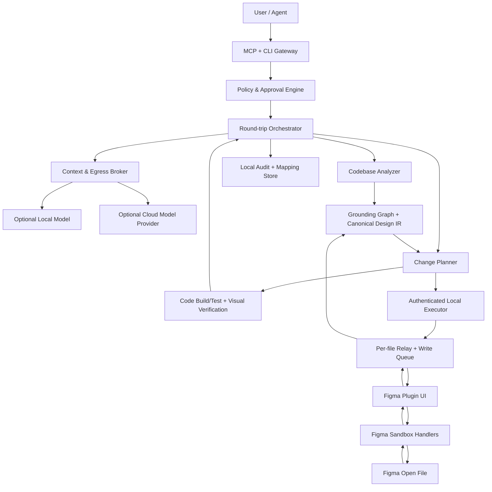

# 로컬 Plugin API 기반 통합 서비스 제안서

> 목적: 세 오픈소스의 장점을 결합해 Figma UX를 분석하고 기존·신규 코드에 구현하며, 반대로 코드베이스를 의미 있는 Figma 디자인으로 동기화하는 로컬 우선 서비스 설계  
> 기술 우선순위: Figma REST API·공식 Dev Mode MCP를 기본 경로에서 제외하고, 사용자가 권한을 가진 열린 파일의 Plugin API를 이용  
> 기준일: 2026-08-27 (Asia/Seoul)  
> 선행 비교: [세 오픈소스 상세 비교](04-detailed-comparison.md)

## 1. 한 줄 제안

**Figwright를 코어로 fork하고, figma-mcp-rust의 native 배포·progress/export 패턴과 figmosha2의 `doctor`·helper UX를 흡수한 “로컬 design grounding·round-trip engine”을 만든다.**

이 서비스의 기본 연결은 다음과 같다.

```text
Agent/MCP client 또는 CLI
          │ stdio/local IPC
          ▼
Local Orchestrator + Codebase Grounding
          │ authenticated loopback
          ▼
Figma Plugin UI + sandbox
          │ public Figma Plugin API
          ▼
사용자가 열고 편집할 수 있는 Figma file
```

이 경로는 Figma REST token, REST quota, 공식 Dev Mode MCP 호출을 사용하지 않는다. 다만 Figma 로그인·파일 권한·plugin 실행 자격·Plugin API·배포 정책을 제거하는 기술은 아니며, 타인의 파일이나 접근통제를 우회하는 기능은 범위에 포함하지 않는다.

## 2. 목표와 비목표

### 2.1 제품 목표

1. Figma 선택 영역을 구조·시각·interaction·design-system 관점에서 분석한다.
2. 기존 codebase의 framework, component, token, icon, naming, test convention을 조사한다.
3. 기존 자산을 우선 재사용해 legacy project에 최소 diff로 구현한다.
4. 신규 서비스에서는 선택한 stack과 design system에 맞춰 화면·component를 생성한다.
5. codebase의 component/token/layout을 Figma component/variable/style/node로 역변환한다.
6. Figma와 code의 이후 변화를 baseline과 mapping graph로 비교·동기화한다.
7. 모든 mutation을 preview·승인·audit·검증 가능한 change plan으로 만든다.
8. bridge, deterministic analysis, source mutation, mapping, audit는 기본적으로 로컬에서 처리한다. Cloud model을 쓰는 mode에서는 전송할 design/code context를 별도 egress broker가 preview·redact·승인한다.

### 2.2 명시적 비목표

- Figma 계정 인증, file ACL, `can edit`, 조직 정책을 깨는 기능.
- Figma 웹 DOM injection, reverse engineering, credential 공유.
- 사용자가 열 수 없는 fileKey를 headless하게 가져오는 기능.
- raw screenshot을 “완전한 디자인 복원”이라고 부르는 기능.
- 첫 release에서 모든 framework·native platform을 지원하는 범용 compiler.
- 공개 endpoint에서 임의 Plugin API JavaScript를 실행하는 기능.

## 3. 실현 가능성 판정

| 요구 | 판정 | 현실적 구현 |
|---|---|---|
| 공식 REST/API quota 없이 Figma 읽기 | 가능 | Desktop에서 user-run Plugin API + local relay |
| 공식 MCP 없이 Figma 쓰기 | 가능 | typed local MCP tools + plugin write handlers |
| Starter에서 반복 자동화 | 조건부 가능 | Figma Design에서 plugin 실행 가능한 사용자와 edit 가능한 파일 |
| view-only 파일의 semantic 자동 분석 | 불가 | 기본 inspection/manual export 또는 공식 connector 필요 |
| Figma Desktop 지원 | 가능, 1차 목표 | development plugin side-load |
| Figma Web 지원 | 조건부 | published/private plugin 또는 승인된 artifact connector 필요 |
| Community 공개 live MCP bridge | runtime prototype만 가능; 현행 guideline상 일반적으로 미승인 유형 | 서면 예외 또는 실제 review 승인 전 비목표 |
| code→Figma | 가능 | AST/token parser→Design IR→typed mutation plan |
| 완전 자동 양방향 sync | 단계적 가능 | provenance mapping과 3-way conflict resolution 신설 |
| Figma 완전 대체 | 불가/불필요 | 열린 파일 Plugin API 범위에 집중 |

가장 확실한 MVP는 **Desktop·개인/내부 개발용·single user·Figma Design·edit 가능한 파일**이다. Web/public은 기술 구현보다 배포 경계가 선행 조건이다.

### 3.1 비용 대체 baseline과 측정 원칙

| 경로 | limit authority | local connector가 대체하는 부분 | 남는 비용·제약 |
|---|---|---|---|
| Official Figma MCP | plan·seat, read tool monthly/daily/minute; 일부 write 면제 | 반복 design grounding/read | Figma access, model token, write exempt 여부 |
| Figma REST | endpoint tier·seat·resource plan | file/node/image/variable endpoint | OAuth/app 운영, permission |
| Local Plugin API | open file의 user/plugin runtime | 위 cloud call 대신 local read/write | edit permission, app/plugin session, local compute |

공식 숫자는 release 때 다시 읽는다. 이번 교차 리뷰에서는 동일 공식 MCP URL의 수집 결과가 도구/시점에 따라 상충해 특정 수치를 제품 상수로 채택하지 않았다. Phase 0은 한 화면당 official read call 수, local call 수, calls avoided, wall time, bytes, model tokens, failure rate를 같은 fixture에서 측정하고 [MCP limits](https://developers.figma.com/docs/figma-mcp-server/plans-access-and-permissions/)와 [REST limits](https://developers.figma.com/docs/rest-api/rate-limits/)의 확인일을 기록한다.

## 4. 검토한 세 가지 아키텍처

### 4.1 안 A: Figwright 중심 TypeScript monorepo — 권장

Figwright의 MCP/plugin/shared/grounding 구조를 유지하고 보안·filesystem·reverse pipeline을 강화한다. 필요할 때 native launcher만 Rust로 추가한다.

장점:

- 112 tool과 105 handler의 contract를 그대로 활용한다.
- serializer, component/token/icon join, design diff를 재구현하지 않는다.
- plugin과 server가 같은 TypeScript/Zod 생태계를 공유한다.
- 테스트와 workflow가 가장 풍부하다.

단점:

- codebase가 크고 Node runtime이 필요하다.
- existing local tool annotation과 filesystem 경계를 고쳐야 한다.
- code→Figma compiler는 새로 만들어야 한다.

### 4.2 안 B: Rust core + TypeScript grounding sidecar

figma-mcp-rust를 public MCP/relay로 두고 Figwright grounding을 별도 Node worker로 호출한다.

장점:

- native single binary 배포와 memory-safe server core.
- filesystem/export를 Rust에서 통제하기 쉽다.

단점:

- Rust/TS 사이 schema·version·process lifecycle을 하나 더 관리한다.
- Figwright의 relay/session/tool registry를 사실상 다시 구현한다.
- 병목은 Figma plugin serialization과 LLM context라 Rust 전환 효과가 불확실하다.

### 4.3 안 C: 세 프로젝트 adapter를 유지하는 microkernel

Rust MCP, Figmosha raw bridge, Figwright grounding을 plugin adapter로 병렬 유지한다.

장점:

- 원본 code 변경이 적고 기능 실험이 빠르다.

단점:

- 세 port, 세 protocol, 중복 plugin, session 충돌, audit 분산.
- 같은 Figma file에 여러 executor가 write하는 race.
- 사용자 설치·지원·보안 표면이 가장 크다.

### 4.4 선택

| 기준 | 안 A | 안 B | 안 C |
|---|---:|---:|---:|
| 기존 자산 재사용 | 5 | 3 | 4 |
| contract 일관성 | 5 | 2 | 1 |
| 초기 구현 속도 | 5 | 2 | 3 |
| native 배포 | 3 | 5 | 3 |
| 운영 단순성 | 4 | 2 | 1 |
| 장기 확장성 | 5 | 3 | 2 |
| 권고 | **채택** | 후속 최적화 | 폐기 |

따라서 안 A로 시작하고, 측정 결과 설치·startup·export가 실제 병목일 때만 Rust launcher/worker를 추가한다.

## 5. 프로젝트별 기능 채택안

### 5.1 Figwright에서 가져올 것

| 기능/모듈 | 결정 | 서비스에서의 역할 | 필수 수정 |
|---|---|---|---|
| `packages/shared` envelope/codec/budgets | 채택 | plugin protocol·timeout authority | tool result runtime schema 검증 |
| ToolSpec registry | 채택 | MCP tool single source | side-effect/permission/capability metadata 추가 |
| plugin serializer | 채택 | Figma→Design IR extraction | canonical IR adapter와 provenance 추가 |
| `get_design_context` dedupe/section plan | 채택 | LLM context budget | internal consumer에도 section iterator 적용 |
| component map | 채택 | Figma component↔code symbol | framework adapters와 structured override store |
| token map | 채택 | Figma variable/style↔code token | unit/color-space matching·truncation signal |
| icon map | 채택 | Figma asset↔repo SVG/icon library | duplicate ambiguity·synonym·visual hash |
| project profile/repo walk | 채택 | legacy stack detection | multi-root/non-JS language 확장 |
| design diff | 수정 채택 | Figma baseline | atomic write, schema migration, code-side diff |
| relay session routing | 채택 | 여러 열린 Figma file | pairing auth와 per-file queue |
| election/lifecycle | 채택 | 여러 MCP client | daemon topology 단순화 여부 검토 |
| version skew warning | 채택 | server/plugin compatibility | capability negotiation과 unsafe write block |
| idempotency | 수정 채택 | retry side-effect dedupe | in-flight Promise+durable journal |
| batch | 수정 채택 | compensatable Figma change set | preflight/dry-run/undo verification |
| plugin panel | 수정 채택 | call·context·debug UI | final MCP payload, retention, redaction, approvals |
| codegen/build skills | 채택 | workflow orchestration | scan_components 의미 오류와 policy 문구 수정 |

추가 교차 리뷰에서 `token_map`의 두 plugin read가 같은 session에 pin되지 않아 multi-file에서 variable과 style 결과가 섞일 수 있고, `design_diff` snapshot path가 file identity 없이 nodeId만 사용해 다른 파일과 충돌할 수 있음이 확인됐다. 두 기능은 각각 session pin과 `{file identity, nodeId}` provenance를 추가한 뒤 채택한다. Plugin ZIP의 LICENSE/notice 포함도 release gate로 올린다.

### 5.2 figma-mcp-rust에서 가져올 것

| 기능/아이디어 | 결정 | 활용 |
|---|---|---|
| 6개 OS/architecture npm native launcher | ADR 후 선택 채택 | 원 구현은 Rust server 전용이다. Node embed/worker/installer 중 한 방식을 선택하고 signing/update 비용을 측정 |
| 선언형 compact tool catalogue | 개념 채택 | capability summary와 generated docs |
| progress frame deadline 갱신 | 수정 채택 | 긴 export/scan의 progress, 단 absolute cap·cancel 포함 |
| screenshot concurrency 8 | 측정 후 채택 | bounded export worker pool |
| pure-Rust PDF merge | 선택 채택 | native export worker, 실제 PDF fixture 통과 후 |
| direct token JSON/CSS export | 채택 후보 | grounding과 별도의 deterministic artifact export |
| structured stderr logging | 채택 | payload redaction이 기본인 tracing |
| node ID validator | 보완 채택 | schema-aware recursive URL/ID normalization |
| 12 prompt catalog | 선별 채택 | corrected recipe와 evaluation corpus |

가져오지 않을 것은 single sink bridge, foreign/Unknown port로 forwarding하는 election, 인증 없는 `/rpc`/`ws`, stale socket 동작, process-global traversal flag 복원, partial serializer, lexical path check, TS `any` contract다.

### 5.3 figmosha2에서 가져올 것

| 기능/아이디어 | 결정 | 활용 |
|---|---|---|
| `doctor` | 채택 | server→plugin→file→permission→round-trip 단계 진단 |
| error hint catalog | 채택 | structured error code→actionable recovery knowledge base |
| `sel/page` alias | 채택 | 사용자 자연어와 target resolver 연결 |
| tree/find CLI | 채택 | low-cost local inspection·support 도구 |
| `bF/bS/bN` UX·명명 | 개념 채택 | 구현은 Figwright의 type-aware binding handler를 authority로 사용 |
| `withFonts/setText` UX | 개념 채택 | 구현은 Figwright의 mixed range font handler를 유지 |
| `frame` ordering recipe | test/문서 채택 | 기존 Figwright placement/layout handler에 regression test로 흡수 |
| live incumbent ping | 개념 채택 | session liveness diagnostics |
| UTF-8/Windows UX | 채택 | CJK/emoji layer name과 native shell 지원 |
| raw `new Function` | 기본 폐기 | local expert build에서만 feature flag·1회 승인·audit |

### 5.4 Safe capability-union contract

구현은 machine-readable Union Feature Manifest를 authority로 둔다.

| 원천 surface | 수량 | v0.1 처리 |
|---|---:|---|
| Figwright MCP tools | 112 | 전부 보존; Motion/video는 experimental capability로 유지 |
| Rust unique lexical tools | 2 | `export_tokens`, `export_frames_to_pdf` adapter 추가 |
| figmosha unique service capability | 2 | `doctor`, `import_library_variable` typed tool 추가 |
| **canonical MCP total** | **116** | registry/docs/tests exact gate |
| figmosha helper | 20 | canonical Figwright backend의 alias/recipe/test로 20/20 mapping |
| figmosha CLI parser/동작 | 12/11 | typed CLI command/alias mapping |
| raw evaluator | 1 | service/public build rejected, 후속 expert research만 deferred |

Manifest는 각 tool/helper에 source, schema hash, `native/adapter/alias/deferred/rejected`, implementation path, test path, security policy를 기록한다. Rust/Figwright의 71개 같은 이름은 lexical overlap일 뿐이므로 semantic adapter test 없이 silent alias하지 않는다. Union completeness와 registry parity가 release hard gate다.

## 6. 권장 시스템 아키텍처



### 6.1 모듈 경계

| 모듈 | 책임 | 입력 | 출력 |
|---|---|---|---|
| MCP/CLI Gateway | agent/client interface | typed command | result/progress/error |
| Policy Engine | connector·workspace·operation 권한 | actor, target, operation | allow/deny/approval requirement |
| Context/Egress Broker | model context selection·redaction·budget·consent | IR/code evidence | local/cloud model request manifest |
| Session Broker | Figma file/page/selection routing | activity/explicit session | pinned session capability |
| Figma Reader | plugin node extraction | nodeId/detail/budget | canonical design snapshot |
| Codebase Analyzer | framework/style/component/token/icon scan | workspace roots | project profile + code graph |
| Grounding Engine | design↔code candidate match | snapshots/graphs | mappings/confidence/evidence |
| Change Planner | code/Figma mutation plan | desired state/current/base | ordered plan + inverse/preconditions |
| Code Adapter | AST-aware read/write | plan + language adapter | source diff |
| Figma Executor | typed Plugin API mutation | approved operations | per-op result + post-state |
| Verifier | build/test/render/diff | source/Figma snapshot | pass/fail/discrepancy |
| Mapping Store | durable provenance/baseline | confirmed mappings | versioned local records |
| Audit Store | actor/approval/result | events | append-only local log |
| Doctor | end-to-end diagnostics | environment/session | cause+fix |

`local-first`는 `local-only`와 다르다. Local-only mode는 deterministic analyzer와 local model만 사용한다. Cloud-assisted mode는 provider, 전송 필드, retention 조건을 사용자에게 표시하고 승인된 context만 내보낸다. MCP client가 직접 cloud model을 호출하는 경우에도 plugin-boundary payload와 최종 model payload가 다를 수 있음을 문서화한다.

외부 Claude/Codex/Cursor가 MCP client인 mode에서는 client가 `CallToolResult`를 받는 순간 provider egress가 일어날 수 있어 별도 orchestrator 경로를 우회한다. 따라서 MCP handler 자체가 응답을 반환하기 전에 sensitivity classification, redaction, payload budget, consent policy를 fail-closed 적용해야 한다. Service가 client 이후의 provider 사용을 통제할 수 없다는 한계도 명시한다.

## 7. Canonical Design IR와 Grounding Graph

### 7.1 Design IR 필수 영역

| 영역 | 필드 예 |
|---|---|
| identity | document/page/node ID, type, name, source connector, capturedAt |
| hierarchy | parent, ordered children, component/instance relationship |
| geometry | x/y/width/height/rotation/constraints/min/max/aspect |
| layout | auto-layout/grid/wrap/gap/padding/alignment/grow/sizing/absolute |
| appearance | paints, gradients, image refs, strokes, effects, opacity, blend, masks |
| typography | characters, range styles, fonts, line height, letter spacing, lists, links |
| design system | styles, variables, modes, aliases, bindings, code syntax |
| components | set, variants, properties, overrides, remote/local provenance |
| interactions | reactions, destinations, transition, annotations, Motion |
| assets | image hash, SVG/vector metadata, export intent |
| fidelity | omitted fields, degradation tier, truncation, unsupported reason |
| provenance | source path/node, evidence, confidence, last verified baseline |

Design IR는 Figma wire schema를 그대로 노출하지 않는다. Figma API version 변화는 connector adapter에서 흡수하고, code adapter는 stable IR만 사용한다.

IR envelope은 다음 계약을 추가로 가진다.

- `schemaVersion`, connector/capability version, migration policy.
- `unset`, `mixed`, `unsupported`, `notLoaded`, `omittedByBudget`를 서로 다른 상태로 표현.
- source에서 직접 관찰한 graph와 model이 추론한 semantic value를 분리하고, inference에는 evidence/confidence를 부착.
- coordinate space, transform matrix, precision, unit, color space를 명시.
- Figma file identity+nodeId/component key와 Git tree+code symbol을 함께 써 copy/rename 충돌을 감지.
- binary는 content-addressed external ref로 저장하고 IR에 inline하지 않음.
- lossless persisted snapshot과 LLM용 deduped/budgeted projection을 분리.

### 7.2 Grounding Graph

```text
Figma Component/Instance ── maps_to ── Code Symbol/File
Figma Variable/Style      ── maps_to ── Code Token/Theme Key
Figma Asset               ── maps_to ── SVG/Image/Icon Import
Figma Text/Content        ── maps_to ── i18n/Content Source
Figma Reaction            ── maps_to ── Route/Event/State Transition
```

각 edge는 `confidence`, `evidence`, `verifiedBy`, `verifiedAt`, `baseVersion`을 가진다. Markdown override 파일 하나가 아니라 versioned JSON/SQLite store를 authority로 두고, 사람이 확인한 mapping이 fuzzy result보다 우선한다.

## 8. 핵심 사용자 흐름

### 8.1 Figma UX → 기존 legacy project

1. `doctor`가 plugin, session, file, editor, permission, workspace를 확인한다.
2. 선택 영역을 full fidelity로 읽되 큰 tree는 section plan으로 나눈다.
3. interactions, components, tokens, assets, responsive clues를 별도 분석한다.
4. codebase profile과 component/token/icon graph를 만든다.
5. confirmed mapping을 먼저 적용하고 fuzzy 후보를 confidence와 함께 보여 준다.
6. 기존 component를 재사용하는 최소 source change plan을 만든다.
7. AST-aware patch를 임시 branch/worktree에 적용한다.
8. format/lint/typecheck/test/build를 project convention대로 실행한다.
9. local app screenshot과 Figma screenshot을 visual/layout/text/token diff한다.
10. 사용자가 diff를 승인하면 source 변경과 mapping baseline을 확정한다.

중요 원칙은 “선택 화면을 새 코드로 다시 그리기”보다 **현재 component와 token으로 조립하기**다.

### 8.2 Figma UX → 신규 서비스

1. 목표 framework/styling/test/build를 사용자가 선택하거나 template에서 가져온다.
2. Figma design system을 먼저 code token/component foundation으로 변환한다.
3. 화면별 route/data/state contract를 분리한다.
4. section 단위로 구현·render·검증한다.
5. 공통 component가 안정된 뒤 page composition을 확장한다.

신규 서비스도 screenshot 기반 absolute positioning을 기본으로 하지 않는다. semantic component와 responsive layout이 우선이다.

### 8.3 codebase → Figma

1. code adapter가 component AST, style/token source, asset import, story/example을 읽는다.
2. 가능하면 local render에서 computed bounds와 state screenshots를 수집한다.
3. code graph를 Design IR로 변환하고 기존 Figma mapping을 찾는다.
4. 새 node를 직접 production page에 쓰지 않고 staging page/section plan을 만든다.
5. existing Figma component/variable/style을 우선 instance/bind한다.
6. typed batch를 preflight하고 사용자에게 예상 node count·destructive op·diff를 보여 준다.
7. single-writer queue에서 apply한다.
8. post-read로 실제 state를 다시 추출해 plan과 대조한다.
9. 승인 후 staging 결과를 target page로 이동하고 mapping을 갱신한다.

현재 Figwright의 `get_local_components`는 selection/subtree 범위이며 remote team-library 전체 discovery가 아니다. `scan_components`는 code AST를 찾는다. 따라서 v0.1 component reuse는 현재 file/context에서 확인된 component와 명시적 component key import에 한정하고, remote library discovery는 capability manifest에서 별도 deferred 항목으로 둔다.

### 8.4 이후 양방향 동기화

세 값으로 3-way diff한다.

```text
base: 마지막 승인 snapshot
left: 현재 Figma
right: 현재 code
```

- 한쪽만 변했으면 반대쪽 update plan을 만든다.
- 양쪽이 같은 semantic field를 바꿨으면 conflict로 표시한다.
- 자동 merge는 확신이 높은 token/text/rename 등으로 제한한다.
- component structure/layout/interaction conflict는 사용자가 선택한다.

## 9. Figma UX 분석 기능

| 분석 | 입력 | 결과 |
|---|---|---|
| 구조 분석 | hierarchy/layout/constraints | section/component 후보, nested complexity |
| design-system audit | styles/variables/bindings/raw values | token drift, unbound values, duplicate styles |
| component audit | instances/sets/properties/overrides | reuse rate, variant gaps, detached duplicates |
| responsive audit | sizing/constraints/grid/wrap | breakpoint hypothesis, fixed-size risk |
| interaction audit | reactions/flows/Motion | screen flow graph, missing destinations, state transitions |
| typography/content | rich text/fonts/copy | type scale drift, mixed font, truncation, i18n candidates |
| accessibility heuristic | colors/text/interaction metadata | contrast/target/content warnings; 실제 WCAG 판정은 render 검증 |
| asset audit | images/vectors/icons | duplicate asset, missing source, export/import plan |
| implementation readiness | all grounding | mapped/unmapped/ambiguous code reuse table |
| change audit | baseline/current | field·order·parent·visual diff |

## 10. Connector 모드

### 10.1 Mode A — Desktop Live Bridge: 최우선

- development plugin을 Desktop에서 side-load.
- local daemon과 ephemeral pairing.
- user가 plugin을 수동 실행.
- typed read/write, session pin, audit 제공.
- REST/official MCP를 사용하지 않는 가장 직접적인 경로.

### 10.2 Mode B — Organization Private Plugin

- Organization/Enterprise의 private plugin 배포.
- Desktop/Web에서 조직 구성원이 사용 가능한지 실제 acceptance test.
- 조직 admin policy, data handling, plugin permission 검토.
- 비용 제약은 공식 MCP 대신 local relay를 써 줄일 수 있지만 private distribution 자체의 plan 비용이 있다.

Community에 live MCP bridge를 공개하는 mode는 별도 제품 mode로 두지 않는다. 현행 guideline은 official MCP 밖 programmatic AI access와 Figma Web/Desktop 조작을 위한 별도 package 요구를 일반적으로 승인하지 않는다. 명시적 서면 예외 또는 실제 review 승인 전에는 **비목표**다.

### 10.3 Mode C — Explicit Artifact Exchange

public review가 live MCP bridge를 허용하지 않을 때의 대안이다.

- Figma plugin UI에서 사용자가 명시적으로 “Export Design Package”를 누른다.
- 구조화된 Design IR package를 local file/download로 전달한다.
- local service가 분석·code patch·Figma change package를 만든다.
- 사용자가 plugin UI에서 “Preview/Apply Change Package”를 누른다.
- 지속 WebSocket, background control, raw API exposure를 제거한다.

자동성은 낮아지지만 user awareness·consent와 public review 적합성을 높인다. 이 모드도 승인 가능성을 보장하지는 않으며 public mode의 기본 후보로 평가한다.

### 10.4 Mode D — Official Connector Fallback

- view-only, unopened file, public SaaS, policy상 plugin bridge를 쓸 수 없는 고객용.
- 공식 Figma MCP/REST/API를 선택적으로 사용한다.
- core IR와 grounding은 동일하고 connector만 바뀐다.
- 현행 official MCP의 design context/assets, `use_figma` write-to-canvas, `generate_figma_design` live UI/code-to-canvas, design-system search를 build-vs-buy 대상으로 삼는다.
- 자체 connector는 legacy grounding·audit·workspace safety·local 반복 read에서 차별화하고, vendor-supported 기능을 이유 없이 재구현하지 않는다.

이 모드는 사용자 요청의 비용 우회 목표와 거리가 있지만, 서비스 전체가 특정 배포 경로 때문에 중단되지 않게 하는 business continuity 경로다.

## 11. 보안 설계

### 11.1 반드시 추가할 통제

| 통제 | 설계 |
|---|---|
| loopback 고정 | plugin relay는 `127.0.0.1`만; daemon 내부 client IPC는 선택적으로 named pipe; non-loopback flag 제거 |
| Host/Origin/PNA | Figwright의 Host·Origin gate를 mandatory로 유지하고 DNS rebinding·browser private-network 정책을 검증 |
| pairing | plugin panel에 1회 pairing code, per-launch 128-bit secret |
| secret lifecycle | OS secret store/clientStorage 범위, expiry·rotation·reconnect·file/session binding을 명시 |
| mutual handshake | protocol version, product version, capability, file/session, nonce 검증 |
| workspace sandbox | canonical root allowlist 밖 read/write 금지, symlink/reparse point 검사 |
| URL policy | `https`만, private/local IP 차단, size/MIME/domain 정책, 사용자 승인 |
| operation policy | read/write/filesystem/network/destructive를 별도 분류 |
| approvals | destructive, broad write, external fetch, workspace outside change는 강제 승인 |
| per-file queue | read는 bounded parallel, write는 single-writer FIFO |
| idempotency | in-flight+completed request journal, restart 후 상태 조회 |
| durable saga | precondition/capture/apply/inverse/post-verify journal; 실패 시 partial/unknown 상태와 repair command |
| timeout/cancel | progress와 absolute deadline, sandbox abort 가능한 작업은 취소 |
| audit | actor, target, args hash, approval, result, diff를 local journal에 기록; operational log와 tamper-evident log를 구분 |
| local store privacy | mapping/audit/snapshot encryption option, retention·delete·export·backup policy |
| redaction | text/image/base64/token 값은 기본 로그에서 제거 |
| prompt injection | Figma text/annotation을 untrusted data로 표시, tool instruction과 분리 |
| data egress | model provider로 나가는 payload를 UI에서 preview·policy로 제어 |
| supply chain | action SHA pin, SBOM, npm provenance, plugin/native checksum·signature, controlled update channel |
| editor preflight | Design/Dev/FigJam capability를 call 전에 확인해 unsupported write를 차단 |

Fork release blocker test는 구체적으로 다음 source 결함을 닫아야 한다: `Origin:null`만 가진 fake session은 pairing 없이 연결 불가, `/rpc`·`/abdicate` body는 작은 고정 cap 초과 시 413, dispatch 이후 socket flap은 `outcome-unknown`으로 journal되고 자동 replay 금지, `token_map`의 모든 plugin read는 같은 session에 pin, `design_diff` path는 file identity+nodeId namespace를 사용한다.

동일 사용자 권한으로 이미 실행 중인 malware나 탈취된 OS account는 pairing으로 막을 수 없는 threat-model 밖의 조건이다. 이 경계를 숨기지 않고 문서·security test에 명시한다.

### 11.2 raw expert mode

Figmosha2 방식의 raw script가 꼭 필요하면 다음 조건을 모두 만족할 때만 연다.

- local development build.
- user가 현재 session에서 명시적으로 enable.
- read-only와 mutation을 분리하고 mutation은 1회 승인.
- script source와 target file을 audit.
- network/fs capability는 제공하지 않음.
- Community/public build에서는 compile-time 제거.

## 12. 신뢰성·성능 설계

| 문제 | 설계 대응 |
|---|---|
| 큰 Figma tree | node pre-count, full/compact tier, section pagination |
| repeated component/style | content-addressed dedupe |
| 큰 binary | MessagePack/binary stream, base64 금지 |
| 긴 export | bounded worker pool, progress, cancel, absolute max |
| concurrent mutation | session별 single writer |
| server/plugin skew | capability negotiation, unsafe argument/write block |
| disconnect | request state journal, resume 가능한 read/export, mutation 결과 post-read |
| 여러 파일 | explicit/pinned session, foreground fallback은 보조 |
| repo scan cap | progress·scanned/skipped/truncated 반환 |
| matching scale | normalized index와 top-k candidate, ambiguity 공개 |
| mapping drift | mtime/hash/AST symbol validation과 stale edge report |
| snapshot corruption | schema version, checksum, atomic temp+rename, backup |

성능 목표는 README 수치를 복사하지 않고 benchmark fixture로 정한다. 최소 fixture는 10k node, deep component tree, mixed text, gradients/images, multi-mode variables, 5k source files, duplicate component/icon names을 포함해야 한다.

Figma document와 Git working tree는 공통 ACID transaction으로 묶을 수 없다. 동기화는 durable saga로 정의한다: optimistic precondition hash → isolated source patch → Figma idempotent operation journal → 지원되는 inverse/compensation → `commitUndo` boundary → post-read reconciliation. UI는 `atomic`, `compensatable`, `irreversible`, `outcome-unknown`을 구분한다.

## 13. 테스트 전략

### 13.1 자동 gate

1. Tool registry↔MCP schema↔plugin handler↔result schema exact contract.
2. serializer field projection과 intentional omission ratchet.
3. component/token/icon matching golden corpus.
4. code adapter AST round-trip과 minimal diff test.
5. Origin/Host/pairing/DNS rebinding/path traversal/symlink/SSRF test.
6. concurrent write ordering, in-flight idempotency, timeout-after-mutation test.
7. leader/follower/session/reconnect/skew process E2E.
8. large tree/binary/scan performance budget.
9. artifact package signature/schema/migration test.
10. documentation의 tool 수·명령·지원 matrix sync.

### 13.2 실제 Figma acceptance matrix

| 축 | 필수 환경 |
|---|---|
| host | Windows Desktop, macOS Desktop |
| product | Figma Design, Dev Mode, FigJam |
| distribution | development plugin, private plugin 가능 시 |
| browser | Chrome/Edge/Safari에서 published/private mode |
| plan/access | Starter edit, paid Full edit, Dev read, view-only negative case |
| document | small, large, multi-page, remote library, mixed fonts |
| operation | read, write, batch rollback, export, reconnect, file switch |

Web 지원은 이 matrix가 통과하기 전에는 marketing claim으로 쓰지 않는다.

### 13.3 code implementation acceptance

- target project의 formatter/linter/typecheck/test/build를 모두 실행한다.
- generated code가 existing component/token/icon reuse 규칙을 지킨다.
- screenshot diff뿐 아니라 DOM/semantic/accessibility test를 병행한다.
- changed file과 mapping edge가 서로 일치한다.
- 실패한 검증을 숨기고 “완료”로 표시하지 않는다.

## 14. 단계별 로드맵

### Phase 0 — 정책·기술 spike

Deliverable:

- Desktop development plugin live bridge proof.
- Starter/edit 가능한 파일의 read/write matrix.
- Figma web/private/public distribution 검토 기록.
- 세 MIT notice, figmosha Solar SVG의 CC BY 4.0 attribution/교체 결정, dependency SBOM.
- Figwright upstream baseline·fork version namespace·sync cadence·Node runtime ADR.
- Rust packaging ADR(Node embed/worker/installer/미채택)와 설치 benchmark.

Go 조건:

- user-authorized Desktop flow가 안정적으로 작동.
- product 목표가 unauthorized access가 아닌 local integration으로 고정.

### Phase 1 — Secure Execution Plane

Deliverable:

- Figwright fork baseline.
- pairing, workspace sandbox, side-effect metadata, per-file queue.
- runtime result validation, in-flight idempotency, audit.
- `doctor`와 plugin panel approvals.

Go 조건:

- security/contract/process E2E 통과.
- destructive/filesystem/network action이 무승인 실행되지 않음.

### Phase 2A — React Figma→Legacy Code MVP

Deliverable:

- canonical IR adapter.
- React + Tailwind/CSS Modules profile, component/token/icon grounding.
- AST-aware patch plan.
- build/test/render/visual diff workflow.
- confirmed mapping store.

Go 조건:

- golden projects에서 component mapping top-1 precision, token false-positive, existing asset reuse, test pass, pixel/layout/text discrepancy의 사전 정의 목표 충족.
- large design section workflow가 context budget 안에서 완료.

### Phase 2B — Vue, 이후 Svelte

- Phase 2A의 동일 metric과 corpus를 framework별로 통과시킨다.
- 한 번에 세 framework를 production gate로 묶지 않는다.

### Phase 3A — Code token/style/asset → Figma

Deliverable:

- code token/style/asset adapter.
- Figma variables/styles/assets change set, staging, preflight, post-read verification.

### Phase 3B — 단일 framework component mapping

- React component instance/property를 Figma component/variant에 mapping.
- partial-write/unknown-state rate와 manual correction 수를 측정.

### Phase 3C — Layout/screens와 3-way conflict

- typed mutation planner, durable saga, 3-way baseline.
- component/variable/style/layout semantic preservation.

Go 조건:

- 각 단계의 code→Figma→IR round-trip에서 지원 필드 손실이 허용 목록 이내.
- partial write와 conflict가 명시적으로 보고됨.

### Phase 4 — Web·배포 확장

Deliverable:

- private plugin 또는 explicit artifact exchange mode.
- official connector fallback.
- browser acceptance matrix.
- policy/version re-check automation checklist.

Go 조건:

- 선택한 배포 모델에 대한 Figma 확인과 조직/법률 승인.
- Web을 Desktop과 구분한 정확한 capability matrix.

### Phase 5 — 확장

- Angular/Solid/Nuxt/Next 강화.
- SwiftUI/Flutter/native adapter는 별도 project로 분리.
- Motion, interaction graph, accessibility analysis 확장.
- 측정 결과가 정당화하면 Rust native launcher/export worker.

## 15. MVP 기능 우선순위

### Must

- Desktop development plugin connector.
- selection/page/node full context와 section pagination.
- component/token/icon grounding.
- React legacy code patch; Vue/Svelte는 Phase 2B gate 뒤 활성화.
- typed Figma primitive/layout/text/style/variable/component writes.
- pairing, approval, write queue, audit, workspace sandbox.
- screenshot+code build/test verification.
- mapping store와 design baseline.
- `doctor`.

### Should

- explicit artifact exchange.
- Figma→code incremental design diff.
- code→Figma staging/3-way conflict.
- token CSS/JSON export.
- PDF/image export sandbox.
- plugin final payload preview.

### Could

- Motion(원 Figwright 기능은 보존하되 새 sync 자동화는 후속).
- advanced interaction/state machine extraction.
- native Rust launcher.
- multiple language adapters.

### Won't in first release

- public raw script execution.
- remote unauthenticated relay.
- view-only ACL bypass.
- background DOM scraping.
- all-framework deterministic compiler.

### v0.1 Desktop Internal Preview 완료 계약

| 영역 | 완료 조건 |
|---|---|
| baseline | 원본을 수정하지 않는 standalone `service/` Figwright vendor fork, Node24/pnpm11.24 |
| union | 116 MCP tools, helper20/CLI12 mapping manifest, registry/docs/tests exact |
| security | pairing+Host/Origin, control body cap, authenticated follower, side-effect policy, approval, workspace sandbox |
| concurrency | session write FIFO, bounded reads, in-flight idempotency, socket flap `outcome-unknown` journal |
| grounding | token/component/icon same-session pin, file-identity design baseline, current Figwright grounding 전 기능 |
| added functions | `doctor`, `export_tokens`, `export_frames_to_pdf`, `import_library_variable`, typed figmosha CLI aliases |
| state | loss-aware SnapshotV1와 GroundingGraphV1; full Figma IR 주장은 하지 않음 |
| preserved functions | Figwright 112 전체와 105 handlers; Motion/video/URL import는 capability·approval 하에 보존 |
| quality | frozen install, typecheck, lint, format, knip, build, unit/integration/E2E, artifact/license tests |
| connector | Desktop Figma Design development plugin과 fake/live acceptance 절차; Web/public은 후속 |

Source AST patch, deterministic code→Figma compiler, 3-way merge, Web, native Rust launcher는 이 v0.1 완료 주장에 포함하지 않는다. 기존 Figwright grounding/skills와 79 write tools로 agent-driven 양방향 흐름은 제공하되 deterministic compiler라고 부르지 않는다.

## 16. 라이선스·정책·상용화 gate

### 16.1 코드 라이선스

- 세 프로젝트의 MIT LICENSE와 저작권 고지를 source·binary·npm·plugin zip에 포함한다.
- figma-mcp-rust의 Go 원작/port 고지를 함께 보존한다.
- figmosha2 UI의 Solar/480 Design SVG를 사용하면 CC BY 4.0 creator·source·license link·변경 여부를 `THIRD_PARTY_NOTICES`에 포함하고, 사용하지 않으면 자체 icon으로 교체했음을 기록한다.
- fork 변경 내역과 자체 저작권을 별도 기록한다.
- dependency SBOM과 license notice를 자동 생성한다.
- npm tarball/plugin zip/native binary를 release gate에서 실제 검사한다.

### 16.2 Figma 정책 gate

2026-08-27 현재 공식 문서상 다음 사실을 설계 전제로 둔다.

- Developer Terms는 API·SDK·MCP 등 Developer Resources 사용에 적용된다.
- integration은 양방향 data flow를 허용해야 한다는 조항이 있다. 본 서비스의 read/write 설계는 방향성 요구와 일치하지만 이것만으로 전체 승인을 뜻하지 않는다.
- Community review는 paid offering workaround와 공식 MCP 밖 programmatic AI access를 승인하지 않을 수 있다.
- plugin 실행 product/seat matrix와 design file의 `can edit`가 적용된다.
- private organization plugin은 Organization/Enterprise 기능이다.
- development plugin 제작·import에는 Desktop 흐름이 필요하다.

출시 gate:

1. connector별 허용·제한 matrix를 제품 UI와 문서에 표시한다.
2. public mode는 Figma의 서면 확인 또는 review 승인 전 배포하지 않는다.
3. Terms/version 변경을 release 전 재확인한다.
4. privacy policy, user consent, data retention, third-party model disclosure를 마련한다.
5. 제품 마케팅은 “Figma 라이선스 우회”가 아니라 “REST/공식 MCP에 의존하지 않는 local Plugin API workflow”로 사실대로 표현한다.

공식 자료: [Developer Terms](https://www.figma.com/legal/developer-terms/), [Plugin review guidelines](https://help.figma.com/hc/en-us/articles/360039958914-Plugin-and-widget-review-guidelines), [Use plugins](https://help.figma.com/hc/en-us/articles/360042532714-Use-plugins-in-files), [Guide to inspecting](https://help.figma.com/hc/en-us/articles/22012921621015-Guide-to-inspecting), [How plugins run](https://developers.figma.com/docs/plugins/how-plugins-run/), [Private plugins](https://help.figma.com/hc/en-us/articles/4404228629655-Create-private-plugins-for-an-organization).

## 17. 핵심 리스크와 중단 조건

| 리스크 | 영향 | 완화 | 중단/전환 조건 |
|---|---|---|---|
| public plugin 정책 거절 | Web/public 배포 차단 | artifact/official connector | 승인 없으면 live public mode 중단 |
| Starter/edit 조건 변화 | 비용 우회 가치 감소 | capability gate, official fallback | target user가 plugin 실행 불가 |
| serializer fidelity 부족 | 잘못된 code | projection tests, visual diff | 핵심 layout/text 손실률 목표 미달 |
| code→Figma 모델 편차 | 비결정적 결과 | AST adapter, staging, post-read | golden corpus 안정성 미달 |
| prompt injection | code/file/Figma 오변경 | untrusted labels, approval, sandbox | 무승인 side effect 발견 |
| mapping false positive | 잘못된 component 재사용 | confidence/ambiguity/manual verify | verified mapping 없이 high 자동 적용 |
| Plugin API 변경 | runtime break | typings audit, live release test | supported editor matrix 실패 |
| scope 폭증 | release 지연 | web stack MVP 고정 | native/mobile을 같은 MVP에 포함 요구 |

## 18. 최종 권고

1. **Figwright를 fork해 시작한다.** grounding과 contract가 이 서비스의 가장 어려운 절반을 이미 해결한다.
2. **Desktop internal mode를 첫 제품으로 고정한다.** 사용자의 비용 제약 대체 목표를 가장 빠르고 확실하게 충족한다.
3. **보안을 기능보다 먼저 고친다.** pairing, path sandbox, side-effect metadata, queue, idempotency가 없으면 legacy source와 Figma 문서를 동시에 위험에 놓는다.
4. **Figma→code를 먼저 production화한다.** Figwright의 성숙한 방향이고 즉시 가치가 크다.
5. **code→Figma는 canonical IR·AST adapter·staging으로 재설계한다.** prompt만으로 완성됐다고 간주하지 않는다.
6. **Rust와 figmosha2는 선택적으로 흡수한다.** 중복 서버가 아니라 native launcher/export, doctor/helper로 사용한다.
7. **Web/public은 별도 제품 gate로 둔다.** 기술적 가능성과 배포 허용을 분리하고, 막히면 artifact/official connector로 전환한다.

이 설계라면 세 오픈소스의 실질적 장점을 모두 사용하면서도, “도구 수가 많은 Figma MCP”를 넘어 **기존 codebase를 이해하고 안전하게 양방향 변경을 관리하는 서비스**로 차별화할 수 있다.
